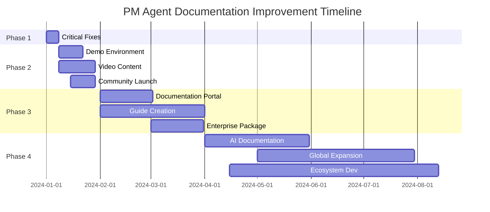

# PM Agent Documentation Improvement Plan

## Executive Summary

This comprehensive plan addresses PM Agent's documentation needs across three key audiences: end users, contributors, and the open-source community. Based on analysis from multiple perspectives, we've identified critical gaps and opportunities for improvement.

### Current State Assessment

**Overall Documentation Health: 6.5/10**

| Audience | Current Rating | Target Rating | Gap |
|----------|---------------|---------------|-----|
| End Users | 6/10 | 9/10 | -3 |
| Contributors | 6.5/10 | 9/10 | -2.5 |
| OSS Community | 7.5/10 | 9/10 | -1.5 |

### Key Findings

#### 🟢 Strengths
- Excellent conceptual documentation with clear metaphors
- Comprehensive architecture documentation
- Well-structured API reference for MCP tools
- Multiple setup options for different environments
- Strong technical foundation

#### 🔴 Critical Issues
1. **Empty installation.md** - Severely damages credibility
2. **No visual demonstrations** - Missing GIFs, videos, or screenshots
3. **Fragmented documentation** - Split between /docs and /docs/sphinx
4. **Missing quickstart** - No "Hello World" in under 5 minutes
5. **No production guides** - Gap between demo and real deployment

#### 🟡 Opportunities
- First-mover advantage in AI agent orchestration space
- Strong potential for educational partnerships
- Community building through showcases and templates
- Enterprise market with proper documentation

## Comprehensive Action Plan

### Phase 1: Critical Fixes (Week 1)
*Budget: $5,000 | Team: 3 people*

#### 1.1 Fill Empty Documentation
- [ ] Complete installation.md with step-by-step instructions
- [ ] Add system requirements and prerequisites
- [ ] Create platform-specific installation guides
- [ ] Add common installation troubleshooting

#### 1.2 Create Unified Getting Started
- [ ] Single canonical quickstart guide
- [ ] "PM Agent in 5 minutes" tutorial
- [ ] Decision tree for setup methods
- [ ] First task assignment walkthrough

#### 1.3 Add Visual Elements
- [ ] Record demo GIF for README
- [ ] Create architecture diagram simplified version
- [ ] Add screenshots for each setup step
- [ ] Design "Built with PM Agent" badge

### Phase 2: Quick Wins (Month 1)
*Budget: $25,000 | Team: 6 people*

#### 2.1 Interactive Demo Environment
```yaml
Features:
  - Web-based playground
  - Pre-configured with sample tasks
  - No installation required
  - Guided tutorial overlay
```

#### 2.2 Video Content Creation
- [ ] 2-minute overview video
- [ ] Setup tutorials for each provider (GitHub, Linear, Planka)
- [ ] "Building a Todo App" complete walkthrough
- [ ] Troubleshooting common issues video

#### 2.3 Community Building
- [ ] Enable GitHub Discussions
- [ ] Create Discord server
- [ ] Launch on Product Hunt
- [ ] Write launch blog post
- [ ] Create project showcase page

#### 2.4 Developer Experience
- [ ] Add requirements-dev.txt
- [ ] Configure pre-commit hooks
- [ ] Set up GitHub Actions CI/CD
- [ ] Create issue/PR templates
- [ ] Add development container config

### Phase 3: Strategic Improvements (Quarter 1)
*Budget: $75,000 | Team: 8 people*

#### 3.1 Documentation Portal
- [ ] Deploy docs.pm-agent.ai
- [ ] Implement search functionality
- [ ] Add version selector
- [ ] Create interactive API explorer
- [ ] Enable community contributions

#### 3.2 Comprehensive Guides

**How-To Guides** (Task-oriented)
- How to debug failed tasks
- How to monitor agent performance
- How to handle task dependencies
- How to integrate with CI/CD
- How to implement custom providers
- How to scale PM Agent

**Tutorials** (Learning-oriented)
- Progressive complexity tutorials
- Real-world project examples
- Video course series
- Interactive challenges

**Reference** (Information-oriented)
- Complete API documentation
- Configuration reference
- Error code reference
- MCP protocol specification

**Explanation** (Understanding-oriented)
- Design decisions
- Performance characteristics
- Security model
- Best practices

#### 3.3 Enterprise Package
- [ ] Security and compliance documentation
- [ ] Deployment architectures
- [ ] ROI calculator
- [ ] Migration guides
- [ ] SLA guidelines

### Phase 4: Long-term Vision (6 months)
*Budget: $200,000 | Team: 10 people*

#### 4.1 AI-Powered Documentation
- Intelligent help chatbot
- Personalized learning paths
- Auto-generated examples
- Natural language search

#### 4.2 Global Expansion
- Multi-language support (start with Spanish, Chinese, Japanese)
- Regional community chapters
- Localized examples and use cases

#### 4.3 Ecosystem Development
- Plugin marketplace
- Worker agent templates
- Integration hub
- Certification program
- Partner showcase

## Success Metrics

### User Metrics
| Metric | Current | 1 Month | 3 Months | 6 Months |
|--------|---------|---------|----------|----------|
| Setup Success Rate | 60% | 80% | 90% | 95% |
| Time to First Task | 2 hours | 30 min | 15 min | 5 min |
| Documentation Completion | 40% | 60% | 75% | 85% |
| User Satisfaction | 6/10 | 7.5/10 | 8.5/10 | 9/10 |

### Community Metrics
| Metric | Current | 1 Month | 3 Months | 6 Months |
|--------|---------|---------|----------|----------|
| GitHub Stars | ~100 | 500 | 2,000 | 5,000 |
| Active Contributors | 1 | 5 | 20 | 50 |
| Discord Members | 0 | 200 | 1,000 | 5,000 |
| Weekly Downloads | ? | 1,000 | 5,000 | 20,000 |

### Business Metrics
| Metric | Current | 1 Month | 3 Months | 6 Months |
|--------|---------|---------|----------|----------|
| Enterprise Inquiries | 0/mo | 2/mo | 10/mo | 25/mo |
| Production Deployments | ? | 5 | 25 | 100 |
| Case Studies | 0 | 1 | 5 | 10 |
| Training Revenue | $0 | $0 | $10k/mo | $50k/mo |

## Resource Allocation

### Immediate Needs
1. **Technical Writer** - Fix documentation gaps
2. **Developer Advocate** - Create demos and tutorials
3. **Community Manager** - Build and engage community
4. **DevOps Engineer** - Improve installation/deployment

### Tools and Infrastructure
- Documentation platform (GitBook/Docusaurus)
- Video production tools
- Community platform (Discord/Discourse)
- Analytics and monitoring
- CI/CD pipeline
- Demo hosting infrastructure

## Risk Mitigation

### Documentation Risks
| Risk | Impact | Mitigation |
|------|--------|------------|
| Outdated docs | High | Automated testing of examples |
| Complexity overload | High | Progressive disclosure design |
| Language barriers | Medium | Start with core languages |
| Version mismatch | Medium | Clear version documentation |

### Community Risks
| Risk | Impact | Mitigation |
|------|--------|------------|
| Toxic behavior | High | Code of conduct + moderation |
| Support overload | High | Self-service resources |
| Fragmentation | Medium | Central community hub |
| Contributor burnout | Medium | Recognition program |

## Implementation Timeline



## Call to Action

### For Project Maintainers
1. **Today**: Fix installation.md and add demo GIF
2. **This Week**: Set up Discord and enable Discussions
3. **This Month**: Launch interactive demo and video series
4. **This Quarter**: Deploy documentation portal

### For Contributors
1. **Help fill documentation gaps** - Pick an empty section
2. **Create examples** - Build something with PM Agent
3. **Make videos** - Tutorial content needed
4. **Translate** - Help reach global audience

### For Users
1. **Try PM Agent** - Give feedback on experience
2. **Share your story** - What did you build?
3. **Join the community** - Help others get started
4. **Spread the word** - Star, share, and showcase

## Conclusion

PM Agent has strong technical foundations but needs documentation improvements to reach its full potential. This plan provides a roadmap to transform PM Agent from a promising project into the industry standard for AI agent orchestration.

The key to success is executing the critical fixes immediately while building momentum through community engagement and continuous improvement. With proper documentation, PM Agent can capture the emerging market for AI-powered development tools.

**Next Step**: Begin with Phase 1 critical fixes this week. The empty installation.md file should be the #1 priority.