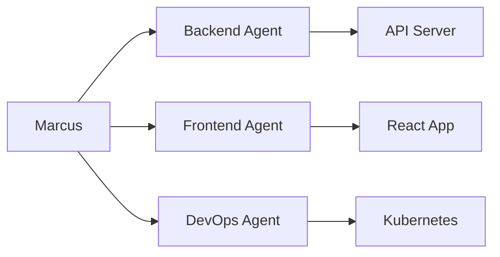

# Community Showcase Template

Use this template to share your Marcus success story with the community! Copy this template and fill in your project details.

---

# [Your Project Name]

**Author**: [Your Name/Organization]  
**Date**: [Month Year]  
**Marcus Version**: [e.g., v1.2.0]  
**Project Duration**: [e.g., 2 weeks, 1 month]  

## 📋 Project Overview

### What We Built
[Describe what you built with Marcus in 2-3 sentences. What problem did it solve?]

### Technology Stack
- **Languages**: [e.g., Python, JavaScript, Go]
- **Frameworks**: [e.g., FastAPI, React, Next.js]
- **Databases**: [e.g., PostgreSQL, MongoDB]
- **Other Tools**: [e.g., Redis, Docker, Kubernetes]

### Team Size
- **Human Developers**: [Number]
- **Worker Agents**: [Number and types]

## 🎯 Why We Chose Marcus

[Explain why you selected Marcus for this project. What specific features attracted you?]

## 📊 Project Setup

### Kanban Provider
- **Provider Used**: [GitHub Projects / Linear / Planka]
- **Board Structure**: [Describe your columns/lists]
- **Task Organization**: [How you structured tasks]

### Worker Agent Configuration
```yaml
# Example of your agent setup
agents:
  - name: Backend Developer
    skills: [python, fastapi, postgresql]
    capacity: 3
    
  - name: Frontend Developer
    skills: [react, typescript, tailwind]
    capacity: 2
    
  - name: DevOps Engineer
    skills: [docker, kubernetes, ci/cd]
    capacity: 1
```

### Task Examples
Provide 2-3 examples of tasks you created:

1. **Task**: [Task title]
   - **Description**: [Brief description]
   - **Labels**: [Labels used]
   - **Assigned to**: [Which agent type]
   - **Result**: [What was delivered]

2. **Task**: [Task title]
   - **Description**: [Brief description]
   - **Labels**: [Labels used]
   - **Assigned to**: [Which agent type]
   - **Result**: [What was delivered]

## 🚀 Results & Metrics

### Development Speed
- **Total Tasks Completed**: [Number]
- **Average Task Completion Time**: [e.g., 2.5 hours]
- **Parallel Work Streams**: [e.g., 3 agents working simultaneously]

### Quality Metrics
- **Test Coverage Achieved**: [e.g., 85%]
- **Bugs Found in Production**: [Number]
- **Code Review Iterations**: [Average per task]

### Cost Comparison
- **Marcus Development Cost**: $[Amount] (API costs)
- **Estimated Traditional Dev Cost**: $[Amount]
- **Savings**: [Percentage or amount]

## 💡 Key Learnings

### What Worked Well
1. [First success point]
2. [Second success point]
3. [Third success point]

### Challenges Faced
1. **Challenge**: [Description]
   - **Solution**: [How you solved it]
   
2. **Challenge**: [Description]
   - **Solution**: [How you solved it]

### Tips for Others
- [Tip 1 based on your experience]
- [Tip 2 based on your experience]
- [Tip 3 based on your experience]

## 📸 Screenshots/Demos

### Architecture Diagram
[Include a diagram of your system architecture]



### Kanban Board View
[Screenshot of your task board during development]

### Final Product
[Screenshots or demo link of what you built]

## 🔧 Configuration Snippets

Share any useful configurations that others might benefit from:

### Custom Marcus Settings
```python
# Example: Custom task assignment logic
PM_AGENT_CONFIG = {
    "assignment_strategy": "skill_priority",
    "max_retries": 3,
    "progress_reporting_interval": 300  # 5 minutes
}
```

### Useful Task Templates
```yaml
# Template for API endpoint tasks
template:
  name: "API Endpoint"
  description: |
    Create {method} endpoint at {path}
    - Implement request validation
    - Add appropriate error handling
    - Write unit tests (minimum 80% coverage)
    - Document in OpenAPI spec
  labels: ["backend", "api", "testing"]
```

## 🎉 Project Outcome

### Business Impact
[Describe the business value delivered]

### Technical Achievements
[List technical milestones reached]

### Future Plans
[How you plan to use Marcus going forward]

## 🙏 Acknowledgments

- Thanks to [anyone who helped]
- Special mention to [specific features/people that were crucial]

## 📞 Contact

Want to know more about our experience?
- **GitHub**: [@yourusername]
- **Twitter**: [@yourhandle]
- **Email**: [your.email@example.com]
- **Project Repository**: [Link if open source]

---

*Would you recommend Marcus to others?* **[Yes/No]**  
*Rating:* ⭐⭐⭐⭐⭐ **[X/5 stars]**

---

## Submission Instructions

1. Copy this template
2. Fill in all sections with your project details
3. Save as `showcase-[your-project-name].md`
4. Submit via:
   - Pull Request to `/docs/community/showcases/`
   - Or email to: showcases@pm-agent.dev
   - Or post in Discord #showcase channel

Thank you for sharing your success story!