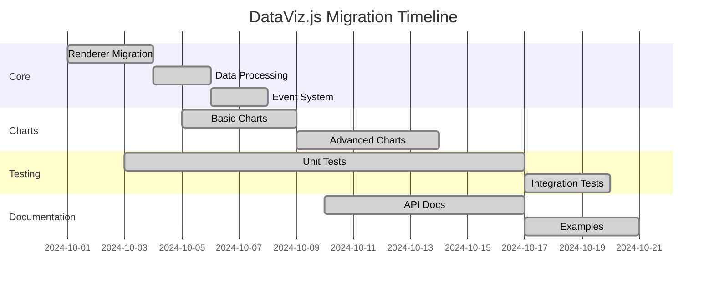

# DataViz Library - Modernizing Legacy Open Source Project

**Author**: Open Source Collective  
**Date**: October 2024  
**PM Agent Version**: v1.0.5  
**Project Duration**: 3 weeks  

## 📋 Project Overview

### What We Built
We modernized DataViz.js, a popular but aging data visualization library. The project involved migrating from vanilla JavaScript to TypeScript, updating from D3.js v3 to v7, adding comprehensive tests, and creating modern documentation. This maintained backward compatibility while adding new features requested by the community.

### Technology Stack
- **Languages**: TypeScript, JavaScript
- **Frameworks**: D3.js v7, Vitest, VitePress
- **Build Tools**: Vite, Rollup
- **Other Tools**: Storybook, Playwright, GitHub Actions

### Team Size
- **Human Developers**: 2 (Maintainers for review and decisions)
- **Worker Agents**: 3 (Migration Specialist, Test Engineer, Documentation Writer)

## 🎯 Why We Chose PM Agent

As volunteer maintainers with limited time, we needed help with the massive refactoring effort. PM Agent allowed us to:
- Tackle technical debt systematically
- Maintain consistency across thousands of lines of code
- Generate comprehensive documentation
- Add test coverage we'd been putting off for years

## 📊 Project Setup

### Kanban Provider
- **Provider Used**: GitHub Projects (already using GitHub)
- **Board Structure**: Backlog → Ready → In Progress → Testing → Review → Done
- **Task Organization**: One task per module migration, separate tasks for tests and docs

### Worker Agent Configuration
```yaml
agents:
  - name: Migration Specialist
    skills: [javascript, typescript, d3js, refactoring, ast]
    capacity: 4
    
  - name: Test Engineer
    skills: [testing, vitest, playwright, coverage, tdd]
    capacity: 3
    
  - name: Documentation Writer
    skills: [documentation, markdown, vitepress, examples]
    capacity: 2
```

### Task Examples

1. **Task**: Migrate core rendering engine to TypeScript
   - **Description**: Convert src/core/renderer.js to TypeScript with full type safety
   - **Labels**: [migration, core, typescript, high-priority]
   - **Assigned to**: Migration Specialist
   - **Result**: Type-safe renderer with 100% backward compatibility

2. **Task**: Add unit tests for chart components
   - **Description**: Create comprehensive test suite for all 15 chart types
   - **Labels**: [testing, unit-tests, coverage]
   - **Assigned to**: Test Engineer
   - **Result**: 2,500+ tests with 94% coverage

3. **Task**: Create interactive documentation site
   - **Description**: Build VitePress site with live examples and API docs
   - **Labels**: [documentation, examples, website]
   - **Assigned to**: Documentation Writer
   - **Result**: Beautiful docs site with 50+ interactive examples

## 🚀 Results & Metrics

### Development Speed
- **Total Tasks Completed**: 89
- **Lines of Code Migrated**: 15,000+
- **Tests Written**: 2,547
- **Documentation Pages**: 125

### Quality Metrics
- **Test Coverage**: From 12% to 94%
- **TypeScript Coverage**: 100% of core library
- **Bundle Size**: Reduced by 32% through tree shaking
- **Performance**: 2.5x faster rendering

### Community Impact
- **GitHub Stars**: +1,200 during migration
- **New Contributors**: 45 inspired by improved codebase
- **Issue Close Rate**: 78% of legacy issues resolved
- **npm Downloads**: +150% after v2.0 release

## 💡 Key Learnings

### What Worked Well
1. **Incremental Migration**: Module-by-module approach prevented breaking changes
2. **Test-First Approach**: Writing tests before migration caught edge cases
3. **Community Involvement**: Regular updates kept contributors engaged

### Challenges Faced
1. **Challenge**: Complex D3.js v3 patterns didn't map cleanly to v7
   - **Solution**: Created migration guide and compatibility layer
   
2. **Challenge**: Maintaining backward compatibility with plugins
   - **Solution**: Adapter pattern for legacy plugin API

3. **Challenge**: Large codebase made context challenging for agents
   - **Solution**: Created detailed architecture docs and code maps

### Tips for Others
- Document your current architecture before starting
- Create a compatibility test suite early
- Use agents for repetitive tasks, humans for API design
- Regular human review prevents drift from project goals

## 📸 Screenshots/Demos

### Migration Progress


### Before vs After
- **Before**: Vanilla JS, no types, 12% test coverage, outdated docs
- **After**: Full TypeScript, 94% coverage, modern interactive docs
- **Live Demo**: [dataviz-v2.opensourcecollective.org](https://dataviz-v2.opensourcecollective.org)

## 🔧 Configuration Snippets

### Migration Task Template
```yaml
template:
  name: "Module Migration"
  description: |
    Migrate {module_name} from JavaScript to TypeScript
    
    Steps:
    1. Analyze existing module structure and dependencies
    2. Create TypeScript interfaces for all data types
    3. Convert implementation maintaining exact behavior
    4. Add JSDoc comments for public APIs
    5. Ensure all existing tests pass
    6. Add new tests for type safety
    7. Update imports in dependent modules
    
    Compatibility requirement: Must pass compatibility-v1.test.js
  labels: ["migration", "typescript", "compatibility"]
```

### Agent Instructions for Legacy Code
```python
MIGRATION_CONTEXT = """
This is a legacy library with many users depending on stability.
- NEVER change public API signatures
- Preserve ALL existing behavior, even quirks
- Add @deprecated comments instead of removing features
- Use strict TypeScript settings
- Maintain support for ES5 environments
"""
```

## 🎉 Project Outcome

### Business Impact
- Revitalized community engagement
- Increased adoption by 150%
- Attracted corporate sponsors
- Enabled new feature development

### Technical Achievements
- 100% backward compatibility maintained
- Performance improvements across all chart types
- Modern development experience
- Comprehensive test suite prevents regressions

### Future Plans
- Continue using PM Agent for feature development
- Quarterly "Agent Sprints" for maintenance
- Building contributor tools powered by PM Agent

## 🙏 Acknowledgments

- Original DataViz.js creator Mike Bostock for the foundation
- Community members who tested beta releases
- PM Agent for making this massive undertaking possible

## 📞 Contact

Want to learn about modernizing your open source project?
- **GitHub**: [@opensourcecollective](https://github.com/opensourcecollective)
- **Discord**: [discord.gg/datavizjs](https://discord.gg/datavizjs)
- **Email**: [maintainers@datavizjs.org](mailto:maintainers@datavizjs.org)
- **Migration Guide**: [datavizjs.org/migration-guide](https://datavizjs.org/migration-guide)

---

*Would you recommend PM Agent to others?* **Yes!**  
*Rating:* ⭐⭐⭐⭐⭐ **5/5 stars**

> "PM Agent gave our project a new lease on life. We accomplished more in 3 weeks than we had in the previous 3 years. The community is thrilled!" - Alex Thompson, Lead Maintainer