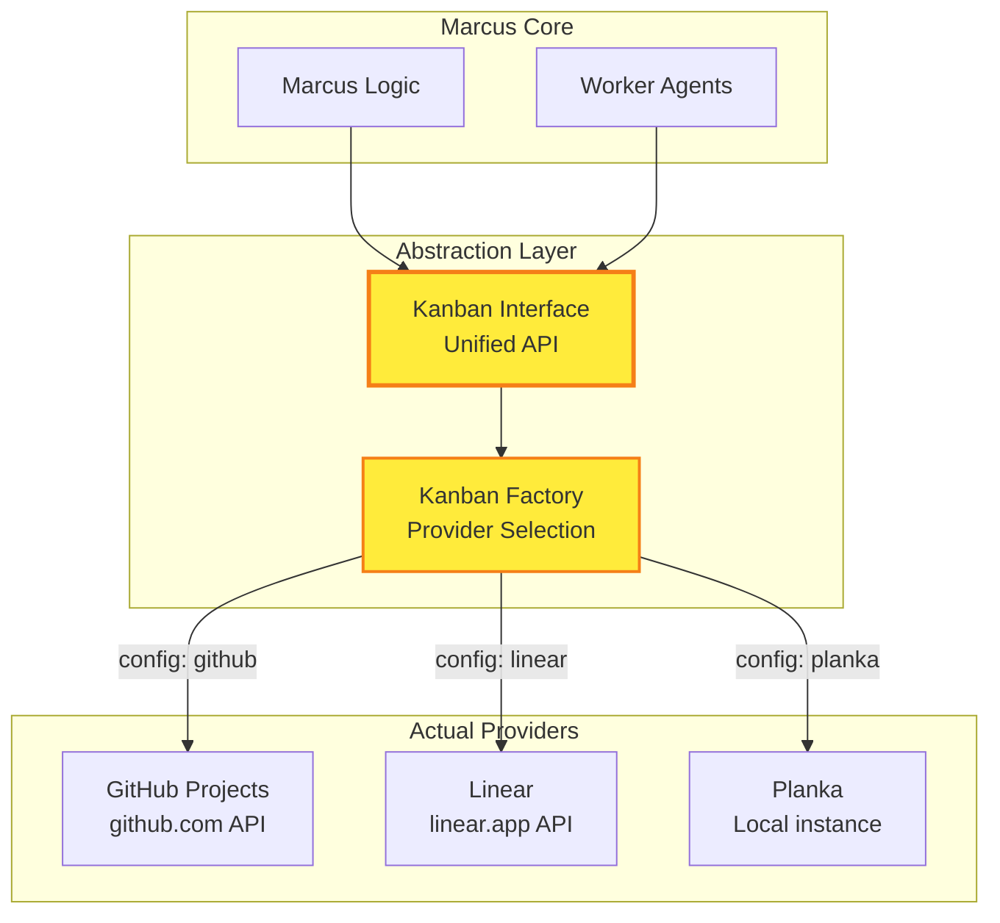
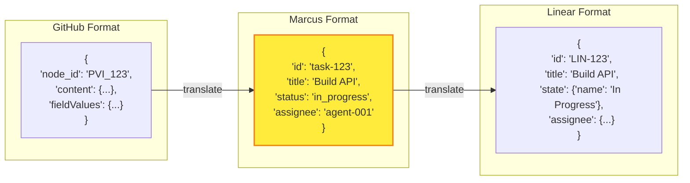

# Understanding Kanban Provider Abstraction

> **Reading time**: 8 minutes  
> **Complexity**: Intermediate

## Introduction

Kanban Provider Abstraction is Marcus's clever way of working with different task board systems (GitHub Projects, Linear, Planka) through one unified interface. It's like having a universal remote that works with any TV brand - write code once, work with any board.

## The Big Picture

Instead of writing different code for each task board system, Marcus uses an abstraction layer. This means Worker Agents and Marcus's core logic don't need to know whether tasks are stored in GitHub, Linear, or Planka - they all look the same from the inside.



## Core Concepts

### Provider Interface

A common set of operations that all kanban providers must implement. This is like a contract that ensures every provider can perform the same basic actions.

**Example**: Every provider must be able to `create_task()`, `update_task()`, `move_task()`, and `get_tasks()` - but how they do it internally differs.

### Factory Pattern

A design pattern that creates the right provider instance based on configuration. The factory decides which concrete implementation to use without the rest of the system knowing.

**In Practice**: When Marcus starts, it reads `KANBAN_PROVIDER=github` and the factory creates a GitHub client, but the rest of Marcus just sees a "kanban client".

### Unified Data Model

Common data structures that work across all providers. Tasks, boards, and lists have the same shape regardless of the underlying system.

**Why It Matters**: A Worker Agent can work with tasks from any provider without knowing the source - they all have `id`, `title`, `description`, etc.

## How It Works

### Step 1: Configuration

Marcus reads which provider to use from environment variables:

```bash
# Option 1: GitHub Projects
KANBAN_PROVIDER=github
GITHUB_TOKEN=ghp_xxxxx
GITHUB_PROJECT_URL=https://github.com/users/myname/projects/1

# Option 2: Linear
KANBAN_PROVIDER=linear
LINEAR_API_KEY=lin_api_xxxxx
LINEAR_TEAM_ID=TEAM123

# Option 3: Planka (local only)
KANBAN_PROVIDER=planka
# Planka uses MCP connection, no API key needed
```

### Step 2: Factory Creation

The Kanban Factory creates the appropriate client:

```python
class KanbanFactory:
    @staticmethod
    def create_client(provider_type: str) -> KanbanInterface:
        if provider_type == "github":
            return GitHubKanbanClient(
                token=os.getenv("GITHUB_TOKEN"),
                project_url=os.getenv("GITHUB_PROJECT_URL")
            )
        elif provider_type == "linear":
            return LinearKanbanClient(
                api_key=os.getenv("LINEAR_API_KEY"),
                team_id=os.getenv("LINEAR_TEAM_ID")
            )
        elif provider_type == "planka":
            return PlankaKanbanClient(
                mcp_connection=get_mcp_connection()
            )
        else:
            raise ValueError(f"Unknown provider: {provider_type}")
```

### Step 3: Unified Interface

All providers implement the same interface:

```python
class KanbanInterface:
    async def get_tasks(self, status: Optional[str] = None) -> List[Task]:
        """Get all tasks, optionally filtered by status"""
        pass
    
    async def create_task(self, title: str, description: str, **kwargs) -> Task:
        """Create a new task"""
        pass
    
    async def update_task(self, task_id: str, updates: dict) -> Task:
        """Update an existing task"""
        pass
    
    async def move_task(self, task_id: str, to_status: str) -> Task:
        """Move task to a different status/column"""
        pass
    
    async def add_comment(self, task_id: str, comment: str) -> Comment:
        """Add a comment to a task"""
        pass
```

### Step 4: Provider Translation

Each provider translates between its native format and Marcus's unified model:



## Real-World Analogy

The Kanban Provider Abstraction is like a universal power adapter for international travel:

- **Power Adapter = Abstraction Layer**: Provides a standard interface
- **Different Outlets = Different Providers**: US, UK, EU outlets (GitHub, Linear, Planka)
- **Your Device = Marcus**: Doesn't care about outlet type, just needs power
- **Electricity = Task Data**: Same purpose, different delivery methods

Just like your laptop doesn't need to know about different outlet standards:
- Marcus doesn't know about GitHub's GraphQL API
- Worker Agents don't know about Linear's data structure  
- The system just knows about "tasks" and "boards"

## Common Misconceptions

### Misconception 1: All features work on all providers
**Reality**: Providers have different capabilities. GitHub might support custom fields that Planka doesn't. The abstraction handles core features; provider-specific features need special handling.

### Misconception 2: It's slower than direct API calls
**Reality**: The abstraction layer adds negligible overhead. Most time is spent in network calls to the provider APIs, not in translation.

### Misconception 3: You can switch providers mid-project
**Reality**: While technically possible, each provider has different IDs and data. Switching providers means starting fresh or migrating data.

## When to Use This

Choose your provider based on your needs:

### GitHub Projects
- ✅ You're already using GitHub for code
- ✅ Want integrated issue tracking
- ✅ Need public visibility options
- ✅ Free for public projects

### Linear
- ✅ Professional team environment
- ✅ Advanced workflow features
- ✅ Better performance for large projects
- ✅ Built for software teams

### Planka
- ✅ Complete data control (self-hosted)
- ✅ Local development only
- ✅ No external dependencies
- ✅ Free and open source

## Trade-offs and Alternatives

### Advantages
- **Provider Independence**: Switch providers by changing config
- **Consistent Interface**: Same code works with all providers
- **Easier Testing**: Mock one interface instead of three
- **Future Proof**: Easy to add new providers

### Limitations
- **Lowest Common Denominator**: Can only use features available in all providers
- **Translation Overhead**: Some provider-specific optimizations lost
- **Configuration Complexity**: Each provider needs different settings
- **Provider Limitations**: Inherit limitations of chosen provider

### Alternatives
- **Direct Integration**: Write provider-specific code (more features, less flexible)
- **Single Provider**: Commit to one system (simpler but locked in)
- **Custom Board**: Build your own task system (maximum control, maximum work)

## In Practice

### Example Scenario

Let's see how the same task operation works across providers:

```python
# Marcus creates a task - same code for any provider
async def create_development_task():
    kanban = KanbanFactory.create_client(
        os.getenv("KANBAN_PROVIDER", "github")
    )
    
    task = await kanban.create_task(
        title="Implement user authentication",
        description="Add JWT-based auth to the API",
        labels=["backend", "security"],
        priority="high"
    )
    
    return task.id
```

Behind the scenes, each provider handles it differently:

**GitHub**: Creates a project item with field values
```json
{
    "project_id": "PVT_kwDOBKD8Zs4AQjzX",
    "field_values": {
        "Title": "Implement user authentication",
        "Status": "Todo",
        "Priority": "High"
    }
}
```

**Linear**: Creates an issue in the team workspace
```json
{
    "teamId": "TEAM-123",
    "title": "Implement user authentication",
    "stateId": "state-todo-id",
    "priority": 1,
    "labelIds": ["label-backend", "label-security"]
}
```

**Planka**: Uses MCP to create a card
```python
mcp.call_tool("create_card", {
    "boardId": "board-123",
    "listId": "list-todo",
    "name": "Implement user authentication",
    "description": "Add JWT-based auth to the API"
})
```

### Code Example

Here's a simplified version of how providers implement the interface:

```python
# Base interface all providers must implement
class KanbanInterface(ABC):
    @abstractmethod
    async def get_tasks(self, status: Optional[str] = None) -> List[Task]:
        pass

# GitHub implementation
class GitHubKanbanClient(KanbanInterface):
    async def get_tasks(self, status: Optional[str] = None) -> List[Task]:
        query = """
        query($project_id: ID!, $status: String) {
            node(id: $project_id) {
                ... on ProjectV2 {
                    items(first: 100) {
                        nodes {
                            id
                            fieldValues(first: 10) {
                                nodes {
                                    ... on ProjectV2ItemFieldTextValue {
                                        text
                                        field { name }
                                    }
                                }
                            }
                        }
                    }
                }
            }
        }
        """
        result = await self._graphql(query, variables={...})
        return self._transform_to_tasks(result)

# Planka implementation  
class PlankaKanbanClient(KanbanInterface):
    async def get_tasks(self, status: Optional[str] = None) -> List[Task]:
        cards = await self.mcp.call_tool("get_cards", {
            "boardId": self.board_id
        })
        
        tasks = []
        for card in cards:
            if status and card["list"]["name"] != status:
                continue
                
            tasks.append(Task(
                id=card["id"],
                title=card["name"],
                description=card["description"],
                status=card["list"]["name"]
            ))
        
        return tasks
```

## Going Deeper

Ready to learn more? Explore:
- 📚 [Provider Comparison Guide](/reference/provider-comparison) - Detailed feature matrix
- 🔧 [Adding New Providers](/how-to/add-kanban-provider) - Extend Marcus
- 📖 [Provider API Reference](/reference/kanban-providers-api) - Technical details

## Summary

Kanban Provider Abstraction lets Marcus work with different task board systems through one unified interface. This design pattern provides flexibility to choose the right tool for your needs while keeping the codebase clean and maintainable.

## Further Reading

- [Choosing a Provider](/docs/providers)
- [Provider Configuration Guide](/reference/configuration)
- [Factory Pattern Explained](https://refactoring.guru/design-patterns/factory-method)
- [Interface Design Principles](https://en.wikipedia.org/wiki/Interface_segregation_principle)