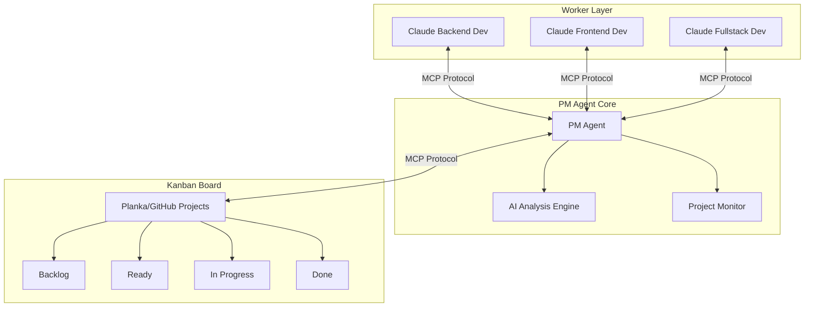
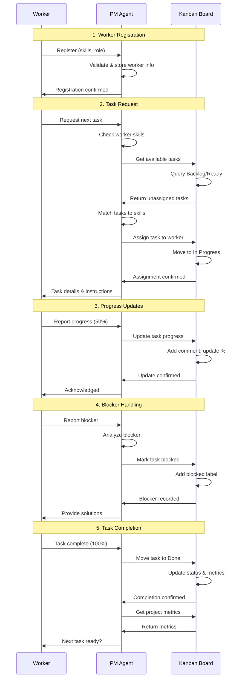
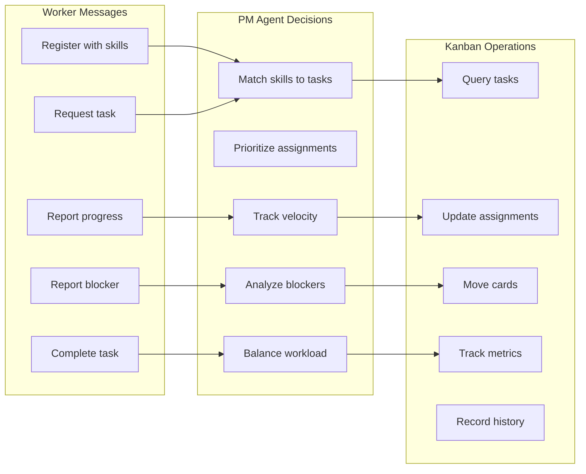
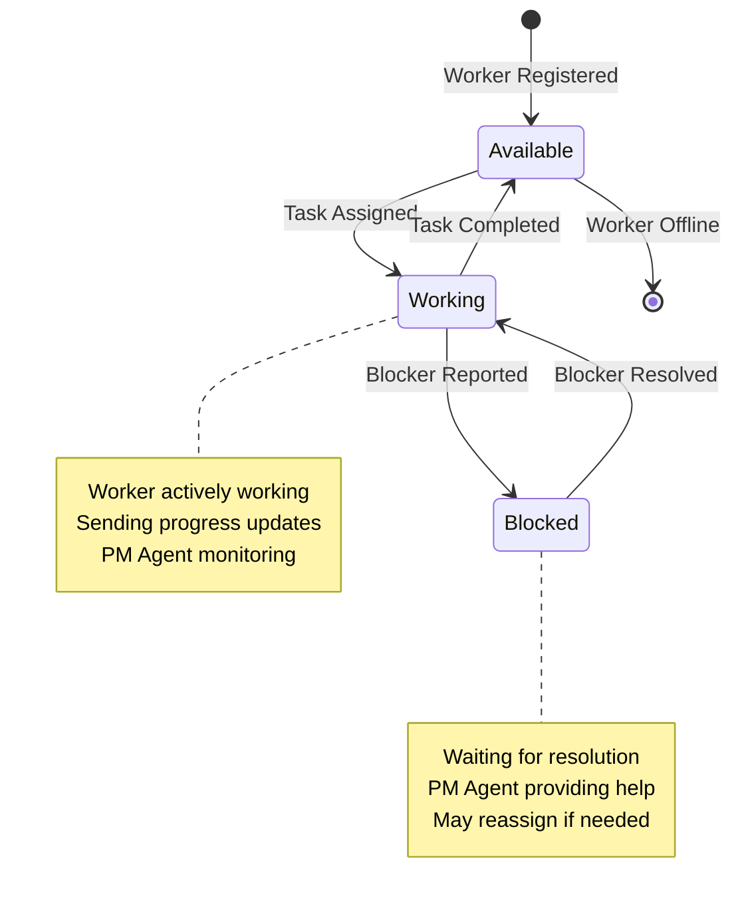
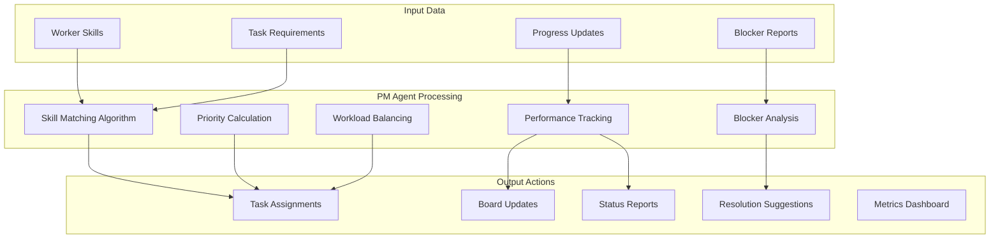
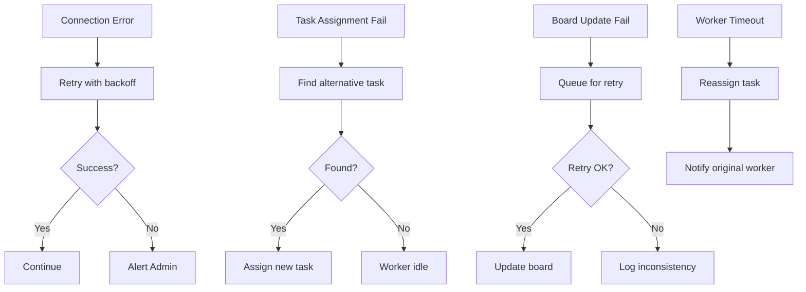

# PM Agent Conversation Flow

## Overview Diagram

```mermaid
graph TB
    subgraph "Worker Layer"
        W1[Claude Backend Dev]
        W2[Claude Frontend Dev]
        W3[Claude Fullstack Dev]
    end
    
    subgraph "PM Agent Core"
        PM[PM Agent]
        AI[AI Analysis Engine]
        MON[Project Monitor]
    end
    
    subgraph "Kanban Board"
        KB[Planka/GitHub Projects]
        BL[Backlog]
        RD[Ready]
        IP[In Progress]
        DN[Done]
    end
    
    W1 <-->|"MCP Protocol"| PM
    W2 <-->|"MCP Protocol"| PM
    W3 <-->|"MCP Protocol"| PM
    
    PM <-->|"MCP Protocol"| KB
    PM --> AI
    PM --> MON
    
    KB --> BL
    KB --> RD
    KB --> IP
    KB --> DN
```

## Detailed Conversation Flow

```mermaid
sequenceDiagram
    participant W as Worker
    participant PM as PM Agent
    participant KB as Kanban Board
    
    Note over W,KB: 1. Worker Registration
    W->>PM: Register (skills, role)
    PM->>PM: Validate & store worker info
    PM->>W: Registration confirmed
    
    Note over W,KB: 2. Task Request
    W->>PM: Request next task
    PM->>PM: Check worker skills
    PM->>KB: Get available tasks
    KB->>KB: Query Backlog/Ready
    KB->>PM: Return unassigned tasks
    PM->>PM: Match tasks to skills
    PM->>KB: Assign task to worker
    KB->>KB: Move to In Progress
    KB->>PM: Assignment confirmed
    PM->>W: Task details & instructions
    
    Note over W,KB: 3. Progress Updates
    W->>PM: Report progress (50%)
    PM->>KB: Update task progress
    KB->>KB: Add comment, update %
    KB->>PM: Update confirmed
    PM->>W: Acknowledged
    
    Note over W,KB: 4. Blocker Handling
    W->>PM: Report blocker
    PM->>PM: Analyze blocker
    PM->>KB: Mark task blocked
    KB->>KB: Add blocked label
    KB->>PM: Blocker recorded
    PM->>W: Provide solutions
    
    Note over W,KB: 5. Task Completion
    W->>PM: Task complete (100%)
    PM->>KB: Move task to Done
    KB->>KB: Update status & metrics
    KB->>PM: Completion confirmed
    PM->>KB: Get project metrics
    KB->>PM: Return metrics
    PM->>W: Next task ready?
```

## Communication Patterns

```mermaid
graph LR
    subgraph "Worker Messages"
        WM1[Register with skills]
        WM2[Request task]
        WM3[Report progress]
        WM4[Report blocker]
        WM5[Complete task]
    end
    
    subgraph "PM Agent Decisions"
        PMD1[Match skills to tasks]
        PMD2[Prioritize assignments]
        PMD3[Analyze blockers]
        PMD4[Track velocity]
        PMD5[Balance workload]
    end
    
    subgraph "Kanban Operations"
        KBO1[Query tasks]
        KBO2[Update assignments]
        KBO3[Move cards]
        KBO4[Track metrics]
        KBO5[Record history]
    end
    
    WM1 --> PMD1
    WM2 --> PMD1
    PMD1 --> KBO1
    
    WM3 --> PMD4
    PMD4 --> KBO2
    
    WM4 --> PMD3
    PMD3 --> KBO3
    
    WM5 --> PMD5
    PMD5 --> KBO4
```

## State Transitions

```mermaid
stateDiagram-v2
    [*] --> Available: Worker Registered
    Available --> Working: Task Assigned
    Working --> Blocked: Blocker Reported
    Blocked --> Working: Blocker Resolved
    Working --> Available: Task Completed
    Available --> [*]: Worker Offline
    
    note right of Working
        Worker actively working
        Sending progress updates
        PM Agent monitoring
    end note
    
    note right of Blocked
        Waiting for resolution
        PM Agent providing help
        May reassign if needed
    end note
```

## Data Flow

```mermaid
graph TD
    subgraph "Input Data"
        ID1[Worker Skills]
        ID2[Task Requirements]
        ID3[Progress Updates]
        ID4[Blocker Reports]
    end
    
    subgraph "PM Agent Processing"
        P1[Skill Matching Algorithm]
        P2[Priority Calculation]
        P3[Workload Balancing]
        P4[Blocker Analysis]
        P5[Performance Tracking]
    end
    
    subgraph "Output Actions"
        OA1[Task Assignments]
        OA2[Board Updates]
        OA3[Status Reports]
        OA4[Resolution Suggestions]
        OA5[Metrics Dashboard]
    end
    
    ID1 --> P1
    ID2 --> P1
    P1 --> OA1
    
    ID3 --> P5
    P5 --> OA2
    P5 --> OA3
    
    ID4 --> P4
    P4 --> OA4
    
    P2 --> OA1
    P3 --> OA1
```

## Error Handling Flow

```mermaid
graph TB
    E1[Connection Error] --> R1[Retry with backoff]
    E2[Task Assignment Fail] --> R2[Find alternative task]
    E3[Board Update Fail] --> R3[Queue for retry]
    E4[Worker Timeout] --> R4[Reassign task]
    
    R1 --> S1{Success?}
    S1 -->|Yes| C1[Continue]
    S1 -->|No| A1[Alert Admin]
    
    R2 --> S2{Found?}
    S2 -->|Yes| C2[Assign new task]
    S2 -->|No| A2[Worker idle]
    
    R3 --> S3{Retry OK?}
    S3 -->|Yes| C3[Update board]
    S3 -->|No| A3[Log inconsistency]
    
    R4 --> C4[Notify original worker]
```
