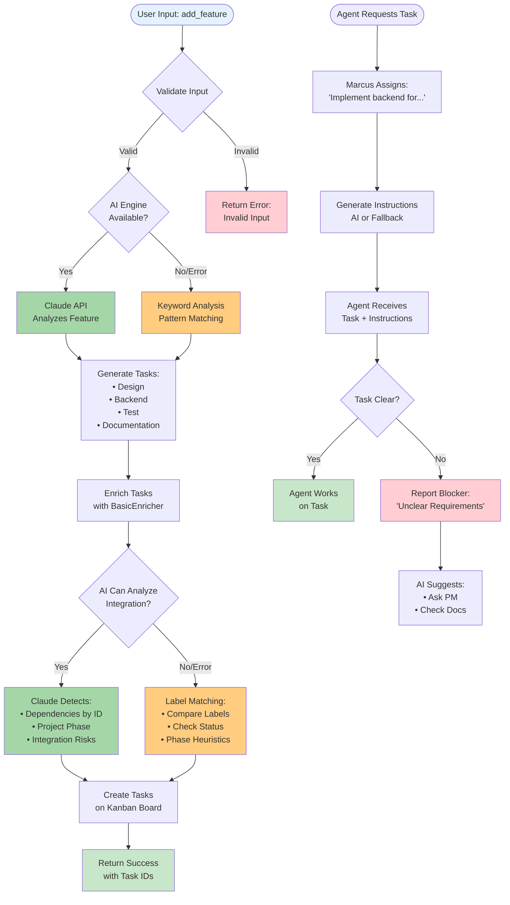
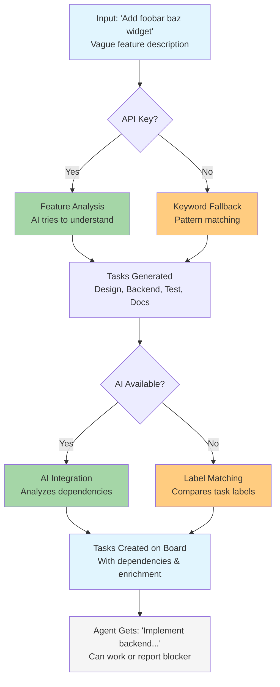
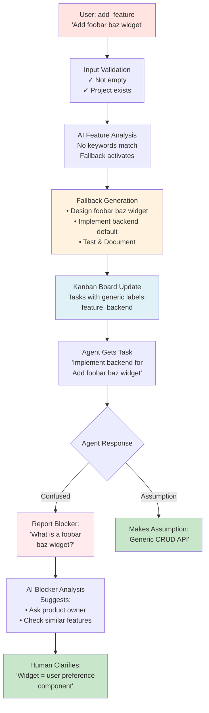
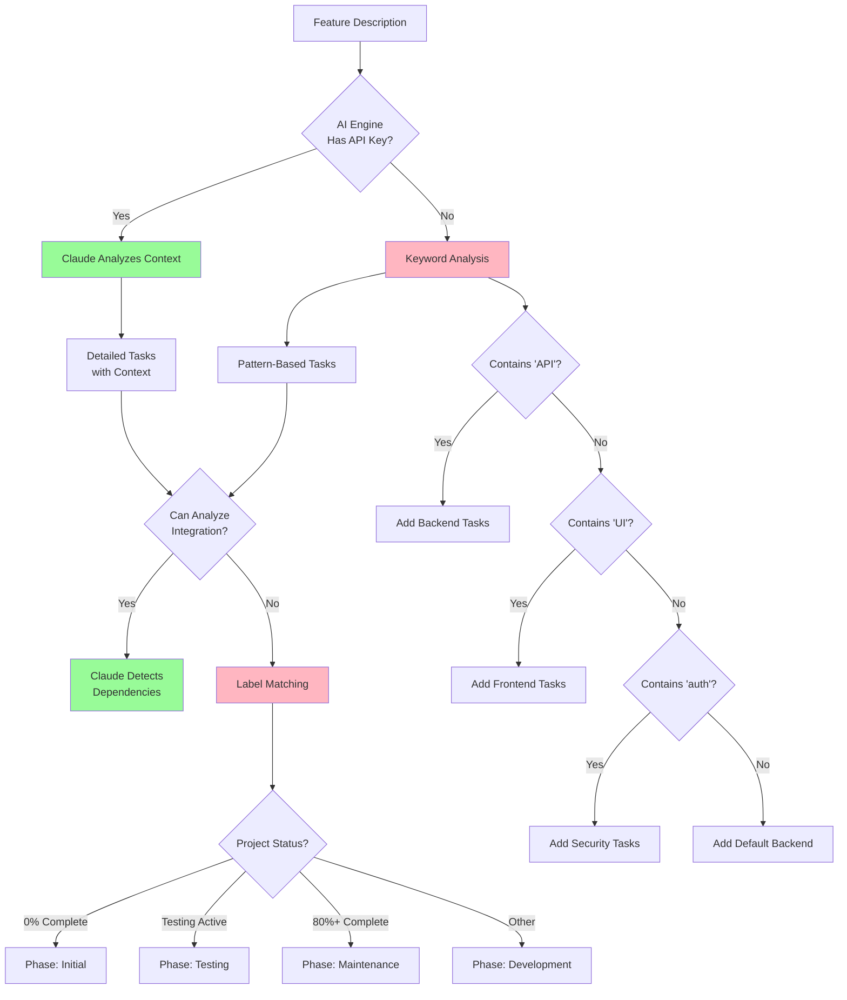
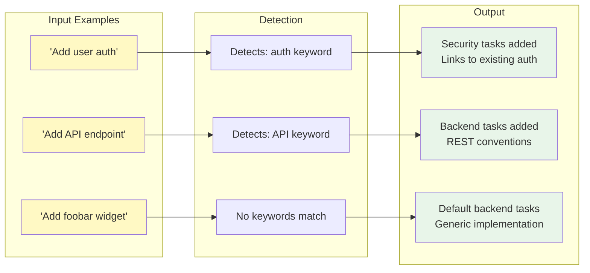

# Marcus add_feature Tool - Mermaid Diagrams

## 1. Main Workflow & Decision Tree

## 2. Smart Fallback Flow

## 3. Vague Task Lifecycle

## 4. Decision Tree for Fallback Mechanisms

## 5. Fallback Intelligence Examples

## Usage in Documentation

To use these diagrams in your markdown documentation:

1. Copy the mermaid code block
2. Paste into any markdown file that supports Mermaid
3. GitHub, GitLab, and many documentation tools render Mermaid automatically

For example:
- GitHub README.md files
- Docusaurus documentation
- MkDocs with mermaid plugin
- Notion pages
- Obsidian notes

## Customization

You can customize colors by modifying the style declarations:
- `fill:#COLOR` - Background color
- `stroke:#COLOR` - Border color
- `stroke-width:2px` - Border thickness

Common color codes used:
- AI/Success: `#A5D6A7` (green)
- Fallback: `#FFCC80` (orange)
- Process: `#E1F5FE` (light blue)
- Error: `#FFCDD2` (light red)
- Input: `#E3F2FD` (pale blue)