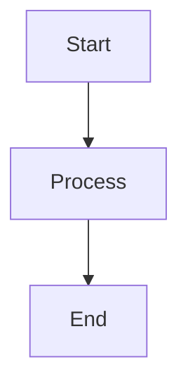

# Building Marcus Documentation

This guide explains how to build the Marcus documentation using Sphinx.

## Prerequisites

1. **Python 3.8+** installed
2. **Required packages** (install if not already present):
   ```bash
   pip install sphinx sphinx_rtd_theme myst-parser sphinx-copybutton sphinxcontrib-mermaid
   ```

## Quick Build

From the project root directory:

```bash
# Build HTML documentation
cd docs/sphinx
make html

# View the docs
open build/html/index.html  # macOS
# OR
xdg-open build/html/index.html  # Linux
# OR
start build/html/index.html  # Windows
```

## Build Options

### Clean Build
Remove previous build artifacts and rebuild:
```bash
cd docs/sphinx
make clean html
```

### Live Reload Development
For automatic rebuilds during documentation development:
```bash
pip install sphinx-autobuild
cd docs/sphinx
sphinx-autobuild source build/html
# Then open http://127.0.0.1:8000 in your browser
```

### Other Formats
```bash
# PDF (requires LaTeX)
make latexpdf

# Single HTML page
make singlehtml

# Plain text
make text
```

## Adding New Documentation

1. **Markdown files**: Place `.md` files in `docs/` or `docs/sphinx/source/`
2. **ReStructuredText files**: Place `.rst` files in `docs/sphinx/source/`
3. **Update index**: Add new files to `docs/sphinx/source/index.rst` toctree

## Mermaid Diagrams

The documentation supports Mermaid diagrams. Use in markdown files:

````markdown

````

## Troubleshooting

### Missing Module Errors
If you get import errors during build:
```bash
# Ensure you're in the docs/sphinx directory
cd docs/sphinx
# The conf.py adds the src directory to Python path
```

### Mermaid Diagrams Not Rendering
1. Ensure `sphinxcontrib-mermaid` is installed
2. Check that it's added to extensions in `conf.py`
3. Try clearing browser cache

### Build Warnings
- **Duplicate labels**: Check for duplicate section headers
- **Missing references**: Ensure all referenced files exist
- **Syntax errors**: Check markdown/RST syntax

## CI/CD Integration

For automated documentation builds:

```yaml
# Example GitHub Actions workflow
name: Build Docs
on: [push, pull_request]

jobs:
  docs:
    runs-on: ubuntu-latest
    steps:
    - uses: actions/checkout@v2
    - name: Set up Python
      uses: actions/setup-python@v2
      with:
        python-version: '3.11'
    - name: Install dependencies
      run: |
        pip install -r docs/requirements.txt
    - name: Build documentation
      run: |
        cd docs/sphinx
        make html
    - name: Upload artifacts
      uses: actions/upload-artifact@v2
      with:
        name: documentation
        path: docs/sphinx/build/html/
```

## Documentation Structure

```
docs/
├── BUILD_DOCS.md              # This file
├── AI_ENGINE_COMPREHENSIVE_GUIDE.md
├── PM_AGENT_SYSTEM_ARCHITECTURE.md
└── sphinx/
    ├── Makefile               # Build commands
    ├── make.bat              # Windows build
    └── source/
        ├── conf.py           # Sphinx configuration
        ├── index.rst         # Main index
        └── _static/          # Static assets
```