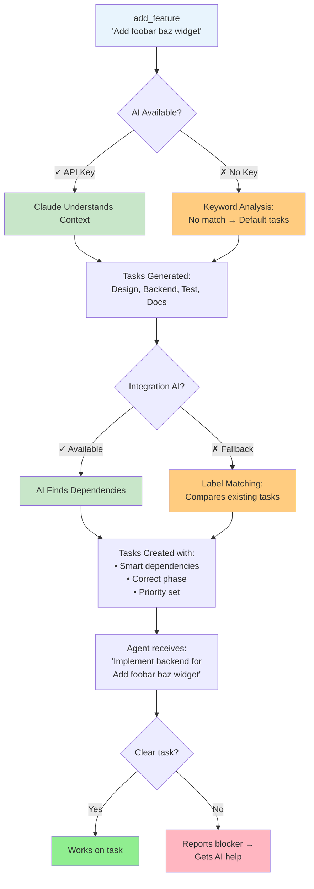
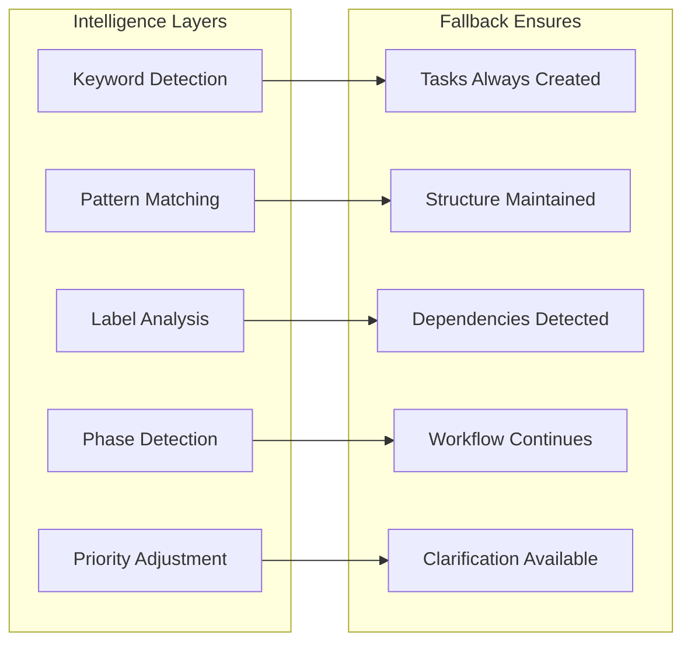
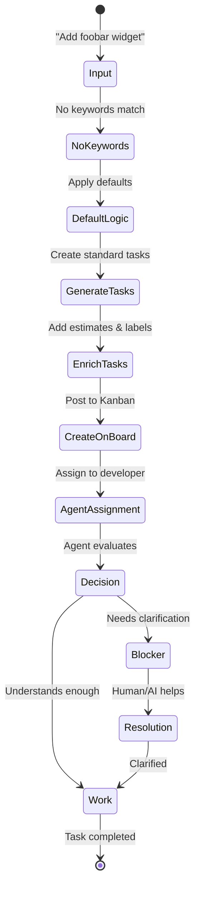

# Simple Mermaid Diagram - add_feature Smart Fallbacks

## Core Decision Flow

## Key Points Visualization

## Example: Vague Input Processing

This simplified Mermaid diagram can be embedded directly in:
- GitHub README files
- Confluence pages  
- Any markdown documentation
- Issue descriptions
- Pull request descriptions