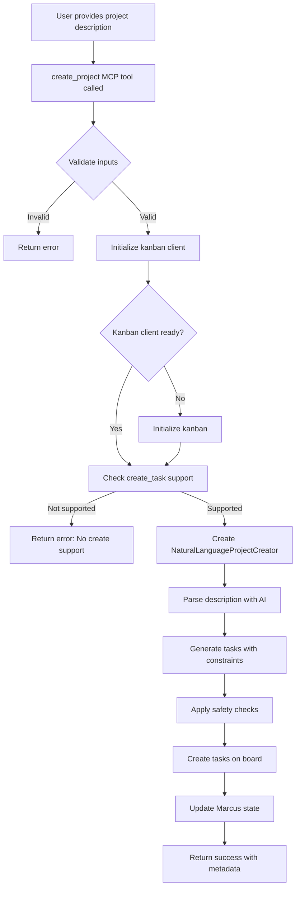
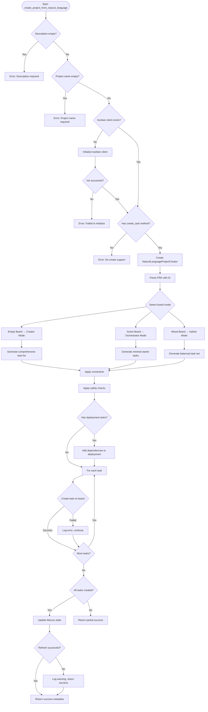
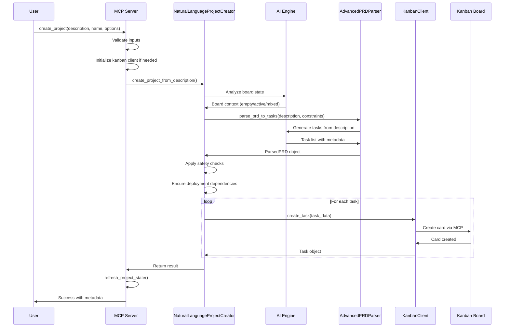
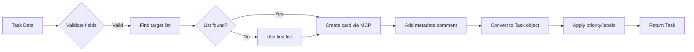
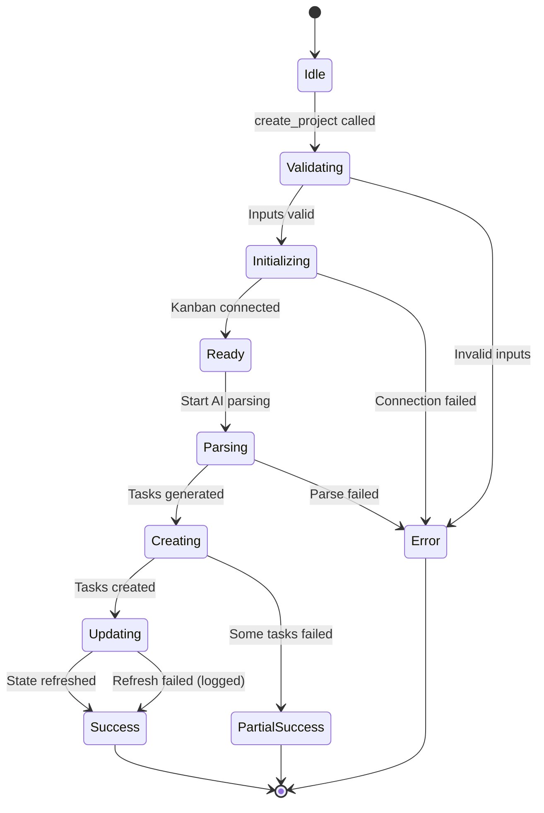

# Create Project Tool Workflow & Decision Tree

## Overview
The `create_project` tool converts natural language project descriptions into structured tasks on a kanban board using AI-powered parsing and intelligent task organization.

## High-Level Workflow



## Detailed Decision Tree



## Component Interactions



## Key Decision Points

### 1. Input Validation
- **Description**: Must be non-empty string
- **Project Name**: Must be non-empty string
- **Options**: Optional, can include team_size, tech_stack, deadline

### 2. Kanban Client Initialization
- Check if client exists
- Verify client supports create_task method
- Use KanbanClientWithCreate for task creation

### 3. Board Context Detection
| Board State | Mode | Behavior |
|------------|------|----------|
| Empty (<3 tasks) | Creator | Generate comprehensive project plan |
| Active (3-50 tasks) | Orchestrator | Generate minimal starter tasks |
| Large (>50 tasks) | Hybrid | Balance new tasks with existing |

### 4. Task Generation Constraints
```python
constraints = {
    "max_tasks": 15,  # Based on team size
    "include_deployment": True,
    "require_testing": True,
    "tech_stack": ["Python", "React"],  # From options
    "deadline": "2025-08-01"  # From options
}
```

### 5. Safety Checks
- Deployment tasks must depend on implementation tasks
- Testing tasks should precede deployment
- No circular dependencies
- Reasonable time estimates

### 6. Error Handling Strategy
| Error Type | Action | User Impact |
|-----------|---------|-------------|
| Validation | Return immediately | Clear error message |
| Kanban init | Return error | Cannot proceed |
| AI parsing | Return error | Cannot generate tasks |
| Single task creation | Log & continue | Partial success |
| State refresh | Log warning | Success returned |

## Task Creation Flow



## State Management



## Error Recovery Mechanisms

1. **Dictionary Iteration Protection**
   - Use `list()` to create snapshots before iteration
   - Prevents "dictionary changed size during iteration"

2. **Partial Success Handling**
   - Continue creating remaining tasks if one fails
   - Report number of successfully created tasks

3. **Graceful Degradation**
   - If AI engine unavailable, return error early
   - If state refresh fails, still return success

4. **Retry Logic**
   - Currently none - fails fast
   - Future: Add exponential backoff for transient failures

## Performance Considerations

- **Batch Creation**: Tasks created sequentially (future: batch API)
- **AI Latency**: ~2-5 seconds for parsing complex descriptions
- **Board Size Impact**: Larger boards take longer to analyze
- **Concurrent Access**: Protected against race conditions

## Usage Examples

### Simple Project
```python
result = await create_project_from_natural_language(
    description="Create a REST API for user management",
    project_name="User API"
)
```

### Complex Project with Options
```python
result = await create_project_from_natural_language(
    description="Build an e-commerce platform with payments",
    project_name="Shop Platform",
    options={
        "team_size": 5,
        "tech_stack": ["Django", "React", "PostgreSQL"],
        "deadline": "2025-12-31"
    }
)
```

## Success Response Structure
```json
{
    "success": true,
    "project_name": "Project Name",
    "tasks_created": 10,
    "phases": ["epic_infrastructure", "epic_features"],
    "estimated_days": 30,
    "dependencies_mapped": 5,
    "risk_level": "medium",
    "confidence": 0.85,
    "created_at": "2025-06-28T20:00:00.000Z"
}
```