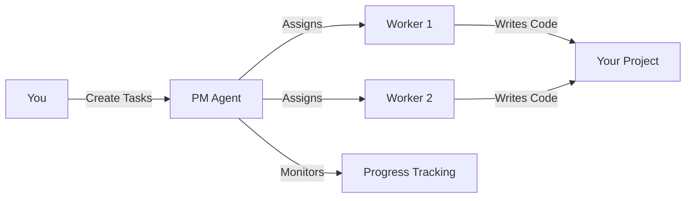

# 5-Minute Quickstart

> **Time to complete**: 5 minutes  
> **What you'll build**: Your first AI-managed project with working code

## Prerequisites

Before starting, ensure you have:
- ✅ PM Agent installed ([Installation Guide](installation.md))
- ✅ API keys configured in `.env` file
- ✅ Docker running (if using Docker installation)

## Step 1: Start PM Agent (30 seconds)

Open your terminal and navigate to the PM Agent directory:

```bash
cd pm-agent

# Start PM Agent with demo workers
./start.sh demo
```

You should see:
```
🚀 PM Agent - Easy Docker Setup
================================
🔧 Starting PM Agent in demo mode...
✅ PM Agent is starting up!
```

## Step 2: Create Your First Project (1 minute)

Let's create a simple "Hello World" API project:

```bash
# If using Docker
docker-compose exec pm-agent python scripts/quick_start.py

# If using Python directly
python scripts/quick_start.py
```

This script automatically:
- Creates a new project on your task board
- Sets up initial tasks
- Assigns them to AI workers

## Step 3: Watch AI Workers in Action (2 minutes)

### View Real-time Progress

```bash
# Follow the logs
docker-compose logs -f pm-agent
```

You'll see AI workers:
1. 🎯 Picking up tasks
2. 💭 Planning their approach
3. 💻 Writing code
4. ✅ Completing tasks

### Example Output
```
[Worker-1] Task assigned: Create Hello World API endpoint
[Worker-1] Progress: Setting up Express.js server...
[Worker-1] Progress: Creating GET /hello endpoint...
[Worker-1] Task completed: API endpoint ready at http://localhost:3000/hello
```

## Step 4: Check Your Results (1 minute)

### View the Generated Code

The AI workers create real code in your project:

```bash
# List generated files
ls -la output/hello-world-api/

# View the main file
cat output/hello-world-api/server.js
```

### Test the API

```bash
# The workers even provide test commands!
cd output/hello-world-api
npm install
npm start

# In another terminal:
curl http://localhost:3000/hello
```

## Step 5: Explore the Dashboard (30 seconds)

If you started with `./start.sh full`, visit the visualization dashboard:

🌐 Open [http://localhost:4298](http://localhost:4298)

You'll see:
- 📊 Real-time task progress
- 🤖 Active AI workers
- 📈 Project metrics
- 🔄 Task flow visualization

## What Just Happened?

In just 5 minutes, you:
1. ✅ Started PM Agent
2. ✅ Created a project with tasks
3. ✅ Had AI workers build a working API
4. ✅ Tested the generated code

PM Agent orchestrated everything:
- **Task Creation**: Broke down "Build API" into subtasks
- **Worker Assignment**: Assigned tasks to specialized AI workers
- **Code Generation**: Workers wrote actual, working code
- **Progress Tracking**: Monitored and reported progress

## Try Something More Complex

Now that you've seen the basics, try a real project:

### Todo App (Beginner)
```bash
# Create a full Todo application
docker-compose exec pm-agent python projects/todo_app/create_minimal_todo_cards_v2.py
```

This creates:
- REST API with CRUD operations
- Database models
- Basic frontend
- Authentication

### Custom Project
```bash
# Create your own project tasks
docker-compose exec pm-agent python scripts/create_custom_project.py \
  --name "my-project" \
  --description "Build a weather dashboard"
```

## Understanding the Workflow



## Common Commands

### Control PM Agent
```bash
./start.sh          # Basic mode
./start.sh demo     # With demo workers
./start.sh full     # With visualization
docker-compose down # Stop everything
```

### Monitor Progress
```bash
docker-compose logs -f pm-agent      # Live logs
docker-compose exec pm-agent pm-status # Status summary
```

### Manage Tasks
```bash
# List all tasks
docker-compose exec pm-agent pm-task list

# Create a task
docker-compose exec pm-agent pm-task create "Build user authentication"

# View task details
docker-compose exec pm-agent pm-task show <task-id>
```

## Tips for Success

### 1. Start Small
Begin with simple tasks to understand how PM Agent works:
- "Create a REST endpoint"
- "Build a CLI tool"
- "Write unit tests"

### 2. Be Specific
AI workers perform better with clear instructions:
- ❌ "Build app"
- ✅ "Build Express.js REST API with GET/POST endpoints for user management"

### 3. Use Templates
PM Agent includes project templates:
```bash
ls projects/  # View available templates
```

### 4. Monitor Progress
Watch the logs to understand what workers are doing:
```bash
docker-compose logs -f pm-agent | grep -E "(Progress|Completed|Blocked)"
```

## Troubleshooting Quick Fixes

### Workers Not Starting
```bash
# Check worker status
docker-compose ps

# Restart if needed
docker-compose restart pm-agent
```

### Tasks Not Being Picked Up
```bash
# Verify task board connection
docker-compose exec pm-agent python scripts/test_connection.py

# Check for errors
docker-compose logs pm-agent | grep ERROR
```

### API Key Issues
```bash
# Verify keys are loaded
docker-compose exec pm-agent env | grep API_KEY
```

## What's Next?

### Deep Dive into Concepts
📚 [Core Concepts](../concepts/core-concepts.md) - Understand PM Agent's architecture

### Build Something Real
🏗️ [Todo App Tutorial](../tutorials/beginner/todo-app) - Step-by-step guide to building a complete application

### Advanced Configuration
⚙️ [Configuration Reference](../reference/configuration) - Customize PM Agent for your workflow

### Join the Community
💬 [Discord](https://discord.gg/pm-agent) - Get help and share your projects

---

🎉 **You're now ready to build amazing things with AI-powered development!**

> **Remember**: PM Agent is a tool to augment your development, not replace it. Review the generated code and make it your own.