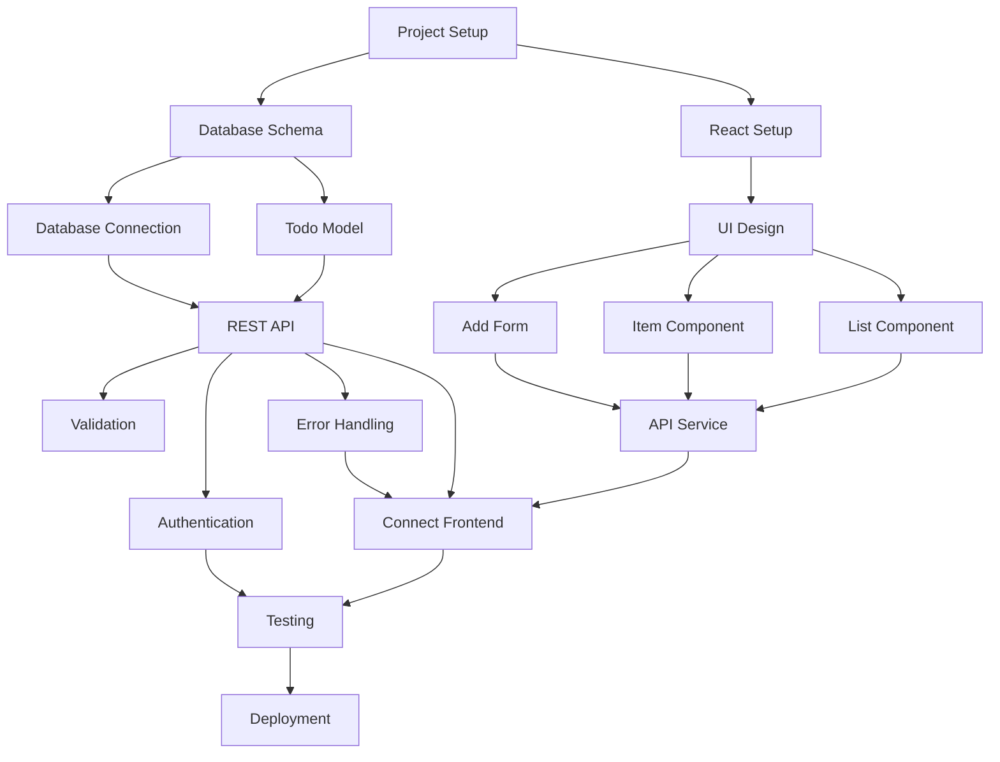

# Building Your First Todo App with PM Agent

> **Time to complete**: 30-45 minutes  
> **Difficulty**: Beginner  
> **Prerequisites**: PM Agent installed and configured

## What You'll Learn

In this tutorial, you'll learn how to:
- Use PM Agent to manage an AI-powered development team
- Watch AI workers collaborate to build a complete Todo application
- Understand how tasks flow through the PM Agent system
- Debug and iterate on AI-generated code
- Experience the magic of autonomous development

## What You'll Build

You'll build a complete Todo application with:
- **Backend API**: FastAPI with SQLite database
- **Frontend**: React web interface
- **Authentication**: User login system
- **Testing**: Automated test suite
- **Documentation**: Auto-generated API docs

The final app will let users:
- Create, read, update, and delete todos
- Mark todos as complete
- Filter and sort their todo list
- Have their own personal todo lists with authentication

## Before You Begin

Make sure you have:
- [ ] PM Agent installed ([Installation Guide](../installation))
- [ ] Your API keys configured in `.env`
- [ ] Docker running on your machine
- [ ] A GitHub repository (if using GitHub as your task board)

## Step 1: Start PM Agent

First, let's start PM Agent with full visualization so you can watch the magic happen:

```bash
# Navigate to PM Agent directory
cd ~/pm-agent

# Start PM Agent with visualization
./start.sh full
```

**Expected output:**
```
🚀 PM Agent - Easy Docker Setup
================================
🔧 Starting PM Agent in full mode...

📦 Starting PM Agent with visualization UI...
✅ PM Agent is starting up!

🌐 Visualization UI will be available at:
  http://localhost:4298
```

💡 **Tip**: Open http://localhost:4298 in your browser to see the real-time visualization dashboard!

## Step 2: Create the Todo App Project

Now we'll create all the tasks needed to build our Todo app. PM Agent comes with a pre-built script that creates a complete set of tasks:

```bash
# In a new terminal, create the Todo app tasks
docker-compose exec pm-agent python projects/todo_app/create_minimal_todo_cards_v2.py
```

**Expected output:**
```
🚀 Creating Todo App cards with minimal information...
✅ Connected to kanban-mcp

📋 Finding Task Master Test project...
✅ Found project: Task Master Test (ID: xxx)
✅ Found board: Task Master Test Board (ID: xxx)

📋 Getting lists...
✅ Found list: Backlog (ID: xxx)

🧹 Clearing existing cards...
  ✅ Cleared 0 existing cards

🏷️  Getting labels...

📝 Creating minimal cards...

[1/17] Creating: Initialize Todo App Project
  ✅ Created card
  ✅ Added 2 subtasks

[2/17] Creating: Create Database Schema
  ✅ Created card
  ✅ Added High Priority label
  ✅ Added 2 subtasks

... (continues for all 17 cards)

✅ Created 17/17 minimal cards!
✨ Minimal Todo App board ready!
```

### Understanding What Just Happened

You've just created 17 interconnected tasks that define the entire Todo app project:

1. **Project Setup** - Initialize the project structure
2. **Database Schema** - Design and create database tables
3. **Todo Model** - Create the core data model
4. **Database Connection** - Set up database connectivity
5. **REST API** - Build the API endpoints
6. **Validation** - Add request validation
7. **Error Handling** - Implement proper error responses
8. **React Setup** - Initialize the frontend
9. **UI Design** - Create the user interface design
10. **List Component** - Build the todo list display
11. **Item Component** - Create individual todo items
12. **Add Form** - Build the form to add todos
13. **API Service** - Create frontend API integration
14. **Connect Frontend** - Wire up frontend to backend
15. **Authentication** - Add user login
16. **Testing** - Write comprehensive tests
17. **Deployment** - Deploy to production

## Step 3: Watch AI Workers Build Your App

Now the exciting part begins! PM Agent will start assigning tasks to AI workers who will build your app autonomously.

### Monitor Progress in Real-Time

1. **Open the Visualization Dashboard**: http://localhost:4298
   - You'll see tasks moving from "Backlog" to "In Progress" to "Completed"
   - Watch AI workers report their progress

2. **Follow the Logs**:
```bash
# Watch detailed logs
docker-compose logs -f pm-agent
```

3. **Check Task Status**:
```bash
# See current project status
docker-compose exec pm-agent pm-status
```

**What you'll see:**
- Workers picking up tasks based on dependencies
- Real-time progress updates (25%, 50%, 75%, 100%)
- Code being generated and saved
- Workers handling blockers and issues

💡 **Tip**: The first tasks (Project Setup and Database Schema) will start immediately as they have no dependencies!

## Step 4: Explore the Generated Code

As workers complete tasks, they'll create actual code files. Let's explore what's being built:

```bash
# Check the project structure
ls -la output/todo-app/

# Look at the backend API
cat output/todo-app/backend/main.py

# Check the database models
cat output/todo-app/backend/models.py

# View the React components
cat output/todo-app/frontend/src/components/TodoList.jsx
```

**Expected project structure:**
```
output/todo-app/
├── backend/
│   ├── main.py           # FastAPI application
│   ├── models.py         # Database models
│   ├── schemas.py        # Pydantic schemas
│   ├── database.py       # Database connection
│   ├── auth.py          # Authentication logic
│   └── requirements.txt  # Python dependencies
├── frontend/
│   ├── src/
│   │   ├── components/  # React components
│   │   ├── services/    # API integration
│   │   └── App.js       # Main app component
│   ├── package.json     # Node dependencies
│   └── public/          # Static files
├── tests/
│   ├── test_api.py      # Backend tests
│   └── test_frontend.js # Frontend tests
├── docker-compose.yml   # Container setup
└── README.md           # Documentation
```

## Step 5: Test the Backend API

Once the backend tasks are completed, let's test the API:

```bash
# Navigate to the backend directory
cd output/todo-app/backend

# Install dependencies
pip install -r requirements.txt

# Run the API server
python main.py
```

**Test the API endpoints:**
```bash
# In another terminal, test creating a todo
curl -X POST http://localhost:8000/todos \
  -H "Content-Type: application/json" \
  -d '{"title": "Learn PM Agent", "completed": false}'

# Get all todos
curl http://localhost:8000/todos

# The API documentation is available at:
# http://localhost:8000/docs
```

## Step 6: Run the Frontend

Once frontend tasks are completed:

```bash
# Navigate to frontend directory
cd output/todo-app/frontend

# Install dependencies
npm install

# Start the development server
npm start
```

Open http://localhost:3000 to see your Todo app!

## Step 7: Understanding Worker Collaboration

Let's examine how the AI workers collaborated:

### Task Dependencies


### Worker Specialization
- **Backend Workers**: Handle Python, FastAPI, SQLAlchemy tasks
- **Frontend Workers**: Build React components and UI
- **Testing Workers**: Write and run tests
- **DevOps Workers**: Handle deployment configuration

## Common Issues

### Issue: Workers are stuck on a task
**Solution**: Check for blockers
```bash
docker-compose exec pm-agent pm-task show <task-id>
```

### Issue: API won't start
**Solution**: Check if the port is already in use
```bash
lsof -i :8000
# Kill the process if needed
kill -9 <PID>
```

### Issue: Frontend can't connect to backend
**Solution**: Ensure CORS is configured properly in the backend
```python
# The AI should have added this to main.py
app.add_middleware(
    CORSMiddleware,
    allow_origins=["http://localhost:3000"],
    allow_methods=["*"],
    allow_headers=["*"],
)
```

## Testing Your Complete App

Let's verify everything works together:

1. **Create a new user** (if authentication is implemented):
```bash
curl -X POST http://localhost:8000/register \
  -H "Content-Type: application/json" \
  -d '{"username": "testuser", "password": "testpass"}'
```

2. **Use the web interface**:
   - Open http://localhost:3000
   - Create some todos
   - Mark them as complete
   - Edit and delete todos

3. **Run the test suite**:
```bash
# Backend tests
cd output/todo-app/backend
pytest

# Frontend tests
cd output/todo-app/frontend
npm test
```

## Summary

Congratulations! 🎉 You've successfully:
- ✅ Used PM Agent to orchestrate AI workers
- ✅ Built a complete Todo application without writing code
- ✅ Learned how tasks flow through the system
- ✅ Watched AI workers collaborate autonomously
- ✅ Tested and verified the generated application

## Next Steps

Now that you've completed this tutorial, you can:
- 📖 Learn about Advanced PM Agent Features
- 🔧 Try the [Custom Workers Tutorial](custom_workers)
- 🚀 Explore the Production Deployment Guide

### Experiment Ideas
1. **Add Features**: Create new tasks to add features like:
   - Todo categories or tags
   - Due dates and reminders
   - Drag-and-drop reordering
   - Dark mode theme

2. **Scale Up**: Try building a larger application:
   - E-commerce platform
   - Blog system
   - Project management tool

3. **Custom Workers**: Create specialized workers for:
   - Mobile app development
   - Machine learning tasks
   - Infrastructure automation

## Get Help

If you run into issues:
- Check our [Troubleshooting Guide](../how-to/troubleshoot-common-issues)
- Ask in our [Discord Community](https://discord.gg/pm-agent)
- Open an [issue on GitHub](https://github.com/lwgray/pm-agent/issues)

---

🎯 **Pro Tip**: The real magic of PM Agent isn't just that it builds code - it's that it manages the entire development process, handling dependencies, blockers, and coordination automatically. You've just experienced the future of AI-assisted development!