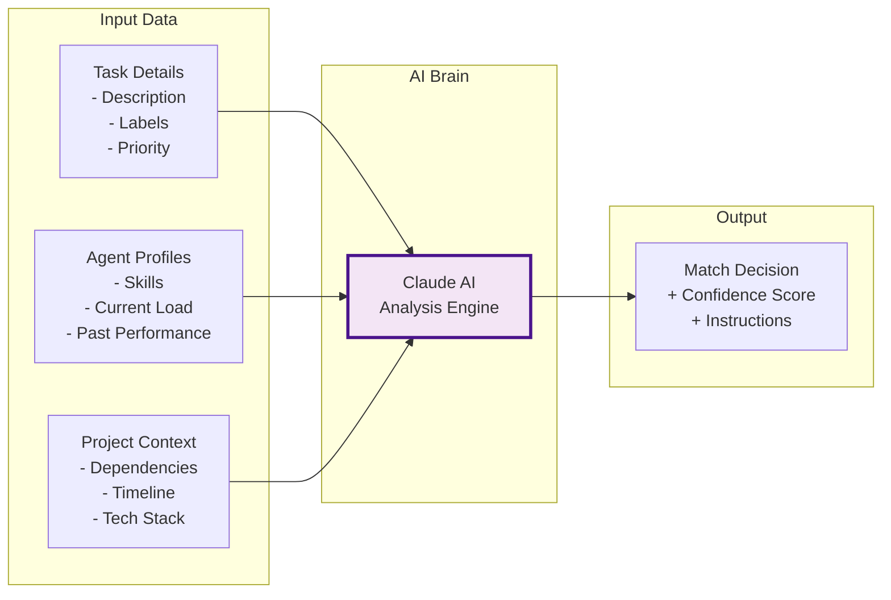
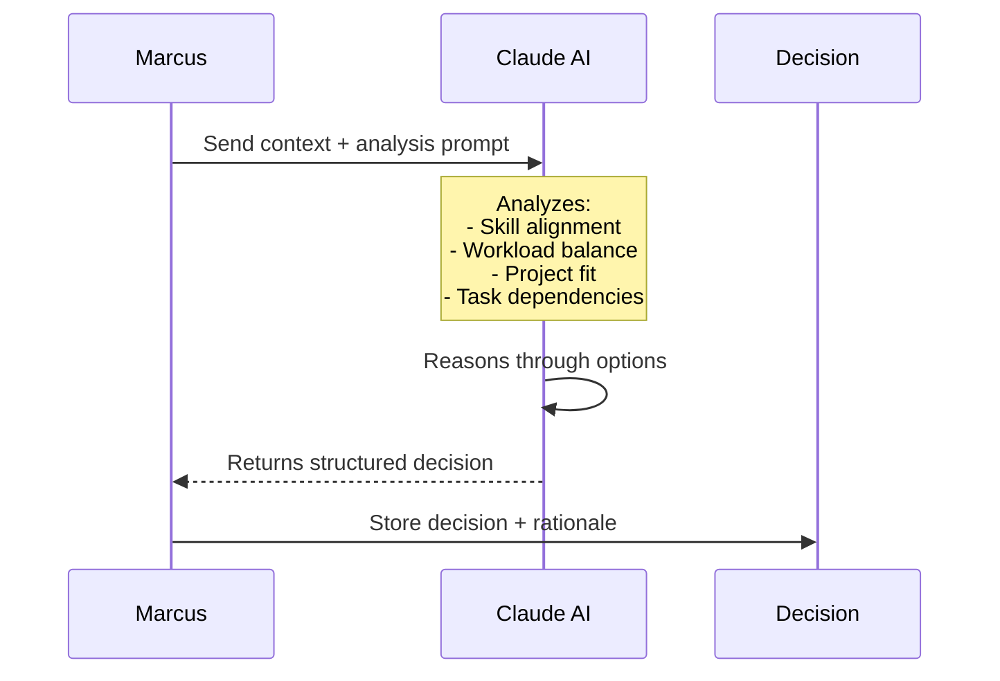

# Understanding Task Assignment Intelligence

> **Reading time**: 12 minutes  
> **Complexity**: Intermediate

## Introduction

Task Assignment Intelligence is Marcus's AI-powered brain that decides which Worker Agent should handle each task. It's like a smart matchmaking system that pairs the right developer with the right job based on skills, availability, and task requirements.

## The Big Picture

In a traditional development team, a project manager assigns tasks based on their knowledge of team members' skills and workload. Marcus's Task Assignment Intelligence does this automatically using AI, analyzing task requirements and agent capabilities to make optimal matches.



## Core Concepts

### Skill Matching

The process of comparing task requirements with agent capabilities to find the best fit. It's not just about exact matches - the AI understands related skills and experience levels.

**Example**: A task requiring "React" might match an agent with "JavaScript, Frontend, Vue" skills because the AI understands they have related expertise.

### Confidence Scoring

A percentage indicating how well-suited an agent is for a task. Higher scores mean better matches, helping Marcus make informed assignment decisions.

**In Practice**: An agent with Python and FastAPI skills might get a 95% confidence score for a "Build REST API" task, while a frontend specialist might score only 40%.

### Context-Aware Instructions

Custom instructions generated for each agent-task pairing, taking into account the agent's specific skills and the project's current state.

**Why It Matters**: The same task might get different instructions for different agents based on their expertise level and the tools they're familiar with.

## How It Works

### Step 1: Gathering Context

When a task needs assignment, Marcus collects comprehensive data:

```python
# Data collected for assignment decision
assignment_context = {
    "task": {
        "id": "task-456",
        "title": "Implement user authentication",
        "description": "Add JWT-based auth to the API...",
        "labels": ["backend", "security", "api"],
        "priority": "high",
        "estimated_effort": "medium"
    },
    "available_agents": [
        {
            "id": "agent-001",
            "skills": ["python", "django", "jwt", "security"],
            "current_tasks": 1,
            "success_rate": 0.92
        },
        {
            "id": "agent-002", 
            "skills": ["nodejs", "express", "mongodb"],
            "current_tasks": 0,
            "success_rate": 0.88
        }
    ],
    "project_state": {
        "tech_stack": ["python", "postgresql", "react"],
        "completed_tasks": ["database-setup", "api-scaffold"],
        "critical_path": ["auth", "user-management", "deployment"]
    }
}
```

### Step 2: AI Analysis

The AI engine processes this context through a sophisticated prompt:



### Step 3: Decision Making

The AI returns a structured decision with reasoning:

```json
{
    "recommended_agent": "agent-001",
    "confidence": 92,
    "reasoning": "Agent-001 has direct experience with JWT and Django, matching the Python tech stack. Their security skills are crucial for authentication tasks.",
    "alternative": {
        "agent_id": "agent-003",
        "confidence": 78,
        "reasoning": "General backend experience but would need to learn Django specifics"
    },
    "risks": ["Agent-001 already has 1 task, monitor for overload"],
    "special_instructions": "Use Django's built-in auth system as a foundation. Implement refresh token rotation for security."
}
```

### Step 4: Instruction Generation

Based on the match, Marcus generates tailored instructions:

```python
# Instructions customized for the selected agent
instructions = {
    "approach": "Leverage your Django experience. Use django-rest-framework-simplejwt.",
    "requirements": [
        "Implement /auth/login, /auth/logout, /auth/refresh endpoints",
        "Use PostgreSQL for user storage (already configured)",
        "Include rate limiting on login attempts"
    ],
    "context": "Database models are in src/models. API structure follows REST conventions.",
    "success_criteria": "All auth endpoints working with tests, 80% coverage minimum"
}
```

## Real-World Analogy

Task Assignment Intelligence is like a seasoned tech recruiter at a staffing agency:

- **Recruiter's Database = Agent Profiles**: Knows each developer's skills and experience
- **Job Requirements = Task Details**: Understands what the client needs
- **Industry Knowledge = AI Context**: Knows which skills work well together
- **Placement Decision = Task Assignment**: Matches the right person to the right job

The recruiter considers:
- Hard skills match (Can they do Python?)
- Soft skills fit (Have they done security work?)
- Availability (Are they overloaded?)
- Project fit (Do they know our tech stack?)

## Common Misconceptions

### Misconception 1: It only matches exact skills
**Reality**: The AI understands skill relationships. A "JavaScript" expert can handle "Node.js" tasks, and "PostgreSQL" experience applies to "database" tasks.

### Misconception 2: It always picks the highest-skilled agent
**Reality**: The system balances skill match with workload, preventing agent burnout and ensuring parallel progress.

### Misconception 3: Assignments are permanent
**Reality**: If an agent gets blocked or can't complete a task, Marcus can reassign it with context from the previous attempt.

## When to Use This

Use Task Assignment Intelligence when:
- ✅ You have multiple agents with varied skills
- ✅ Tasks require different expertise areas
- ✅ You want optimal resource utilization
- ✅ Project has diverse technology needs

Consider alternatives when:
- ❌ All agents have identical skills
- ❌ Tasks are extremely specialized
- ❌ You need specific agent-task pairings

## Trade-offs and Alternatives

### Advantages
- **Optimal Matching**: Better results from skill-aligned assignments
- **Load Balancing**: Prevents agent overload automatically
- **Adaptive Instructions**: Each agent gets relevant guidance
- **Learning System**: Improves over time with feedback

### Limitations
- **AI API Costs**: Each assignment decision uses Claude API
- **Not Always Perfect**: 85-95% accuracy in practice
- **Needs Good Data**: Quality depends on task descriptions
- **No Human Override**: Currently fully automated

### Alternatives
- **Round-Robin**: Simple rotation (ignores skills)
- **Manual Assignment**: Human decides (doesn't scale)
- **First-Available**: Fastest but not optimal
- **Skill-Only Matching**: Ignores workload and context

## In Practice

### Example Scenario
A complex web application project needs various tasks completed:

```yaml
Tasks in Queue:
1. "Build user authentication API" [backend, security, python]
2. "Create responsive dashboard UI" [frontend, react, charts]
3. "Optimize database queries" [database, performance, postgresql]
4. "Write API documentation" [documentation, api, markdown]

Available Agents:
- BackendPro: [python, fastapi, postgresql, redis]
- FrontendNinja: [react, typescript, tailwind, d3]
- FullStackDev: [javascript, python, react, mongodb]
- DataExpert: [sql, postgresql, optimization, python]
```

The Task Assignment Intelligence analyzes and assigns:

1. **Authentication API → BackendPro** (95% confidence)
   - Perfect skill match with Python and security experience
   
2. **Dashboard UI → FrontendNinja** (98% confidence)
   - React expert with D3 for charts
   
3. **Database Optimization → DataExpert** (93% confidence)
   - Specialized in PostgreSQL performance
   
4. **API Documentation → FullStackDev** (82% confidence)
   - Understands both backend and frontend perspectives

### Code Example

Here's how the assignment intelligence works internally:

```python
async def assign_task_intelligently(task, available_agents):
    # Build context for AI
    context = {
        "task": task.to_dict(),
        "agents": [agent.profile for agent in available_agents],
        "project": get_project_context()
    }
    
    # Get AI recommendation
    decision = await ai_engine.analyze_assignment(context)
    
    # Example AI response
    # {
    #     "recommended_agent": "backend-specialist-01",
    #     "confidence": 0.94,
    #     "reasoning": "Strong Python skills, FastAPI experience matches task needs",
    #     "custom_instructions": "Use existing auth middleware in src/middleware/",
    #     "estimated_completion": "4-6 hours"
    # }
    
    # Generate detailed instructions
    instructions = await generate_task_instructions(
        task=task,
        agent=decision.recommended_agent,
        context=decision.reasoning
    )
    
    # Make assignment
    return Assignment(
        task_id=task.id,
        agent_id=decision.recommended_agent,
        confidence=decision.confidence,
        instructions=instructions
    )
```

## Going Deeper

Ready to learn more? Explore:
- 📚 [AI Analysis Engine](/concepts/ai-analysis-engine) - How the AI brain works
- 🔧 [Customizing Assignment Logic](/how-to/customize-assignment) - Tune the matching algorithm
- 📖 [Assignment API Reference](/reference/assignment-api) - Technical details

## Summary

Task Assignment Intelligence is Marcus's smart matching system that pairs the right Worker Agent with the right task. It considers skills, workload, project context, and task requirements to make optimal assignments, then generates custom instructions for each pairing.

## Further Reading

- [Worker Agents Concept](/concepts/worker-agents)
- [AI Engine Architecture](/reference/ai-engine)
- [Performance Tuning Guide](/how-to/optimize-assignments)
- [Claude AI Documentation](https://claude.ai/docs)