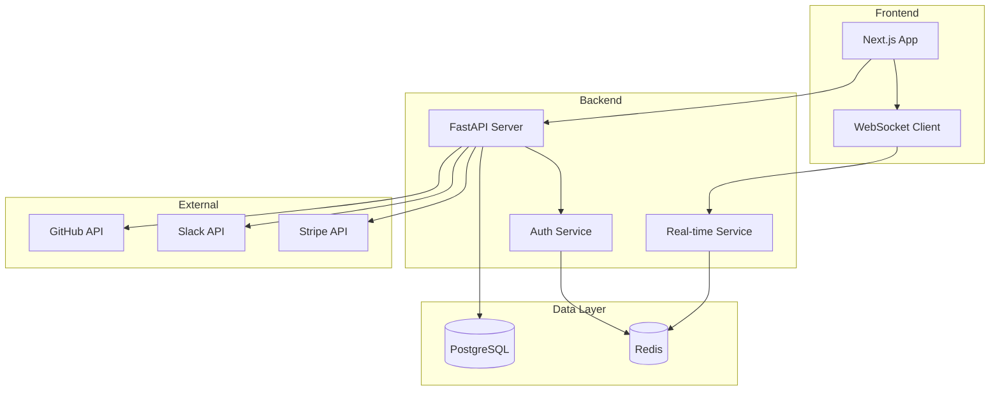

# TechFlow - Building a SaaS MVP in 2 Weeks

**Author**: StartupLabs Inc.  
**Date**: November 2024  
**PM Agent Version**: v1.1.0  
**Project Duration**: 2 weeks  

## 📋 Project Overview

### What We Built
We built TechFlow, a project management SaaS platform for small tech teams. It includes user authentication, team workspaces, kanban boards, real-time updates, and integrations with GitHub and Slack. What typically takes 2-3 months with a traditional team was completed in just 2 weeks using PM Agent.

### Technology Stack
- **Languages**: Python, TypeScript
- **Frameworks**: FastAPI, Next.js 14, PostgreSQL
- **Databases**: PostgreSQL, Redis
- **Other Tools**: Docker, AWS ECS, Stripe, SendGrid

### Team Size
- **Human Developers**: 1 (Technical Lead for architecture decisions)
- **Worker Agents**: 4 (Backend, Frontend, DevOps, Integration Specialist)

## 🎯 Why We Chose PM Agent

As a startup, we needed to validate our idea quickly without burning through our runway. PM Agent offered:
- Parallel development across stack components
- 24/7 development capability
- Consistent code quality
- Built-in best practices

## 📊 Project Setup

### Kanban Provider
- **Provider Used**: GitHub Projects
- **Board Structure**: Backlog → Ready → In Progress → Review → Done
- **Task Organization**: Epics for major features, detailed tasks with acceptance criteria

### Worker Agent Configuration
```yaml
agents:
  - name: Backend Architect
    skills: [python, fastapi, postgresql, redis, auth, testing]
    capacity: 3
    
  - name: Frontend Builder
    skills: [react, nextjs, typescript, tailwind, testing]
    capacity: 3
    
  - name: DevOps Engineer
    skills: [docker, aws, ci/cd, monitoring, security]
    capacity: 2
    
  - name: Integration Specialist
    skills: [api, webhooks, oauth, stripe, sendgrid]
    capacity: 2
```

### Task Examples

1. **Task**: Implement JWT-based authentication system
   - **Description**: Create secure auth with refresh tokens, password reset, and email verification
   - **Labels**: [backend, security, api, high-priority]
   - **Assigned to**: Backend Architect
   - **Result**: Complete auth system with 95% test coverage in 6 hours

2. **Task**: Build responsive kanban board component
   - **Description**: Drag-and-drop kanban board with real-time updates via WebSocket
   - **Labels**: [frontend, ui, real-time, high-priority]
   - **Assigned to**: Frontend Builder
   - **Result**: Fully functional board with optimistic updates in 8 hours

3. **Task**: Set up CI/CD pipeline with staging environment
   - **Description**: Automated testing, building, and deployment to AWS ECS
   - **Labels**: [devops, infrastructure, automation]
   - **Assigned to**: DevOps Engineer
   - **Result**: Complete pipeline with blue-green deployments in 4 hours

## 🚀 Results & Metrics

### Development Speed
- **Total Tasks Completed**: 127
- **Average Task Completion Time**: 3.2 hours
- **Parallel Work Streams**: 4 agents working simultaneously
- **Total Development Time**: 14 days (336 hours of agent work)

### Quality Metrics
- **Test Coverage Achieved**: 89%
- **Bugs Found in Production**: 3 (all minor UI issues)
- **Code Review Iterations**: 1.2 average per task
- **Performance**: <100ms API response time, 95 Lighthouse score

### Cost Comparison
- **PM Agent Development Cost**: $1,847 (Anthropic API costs)
- **Estimated Traditional Dev Cost**: $45,000 (3 devs × 2 months × $7,500/month)
- **Savings**: 96% cost reduction

## 💡 Key Learnings

### What Worked Well
1. **Clear Task Definitions**: Detailed acceptance criteria led to better results
2. **Parallel Development**: Frontend and backend built simultaneously without conflicts
3. **Automated Testing**: Agents wrote comprehensive tests without being reminded

### Challenges Faced
1. **Challenge**: Complex UI interactions were sometimes misunderstood
   - **Solution**: Created visual mockups and detailed interaction descriptions
   
2. **Challenge**: Database migrations needed careful coordination
   - **Solution**: Dedicated migration tasks with explicit dependencies

3. **Challenge**: Third-party API integration required real accounts
   - **Solution**: Human developer handled API key setup, agents used sandboxes

### Tips for Others
- Start with a clear architecture diagram - agents follow it precisely
- Break down complex features into smaller, atomic tasks
- Use labels extensively for better task routing
- Review the first few completed tasks to set quality expectations

## 📸 Screenshots/Demos

### Architecture Diagram


### Final Product
- **Landing Page**: Modern, responsive design with 98 Lighthouse score
- **Dashboard**: Real-time kanban boards with drag-and-drop
- **Integrations**: Seamless GitHub and Slack connectivity
- **Live Demo**: [techflow-demo.startuplabs.io](https://techflow-demo.startuplabs.io)

## 🔧 Configuration Snippets

### Task Template for API Endpoints
```yaml
template:
  name: "RESTful API Endpoint"
  description: |
    Create {method} /api/v1/{resource} endpoint
    
    Requirements:
    - FastAPI router with proper typing
    - Pydantic models for request/response
    - SQLAlchemy queries with pagination
    - Permission checking with get_current_user
    - Error handling with proper HTTP status codes
    - Unit tests with pytest
    - Integration tests with test client
    - Update OpenAPI documentation
    
    Example: GET /api/v1/projects should return paginated project list
  labels: ["backend", "api", "testing"]
```

### PM Agent Optimization Settings
```python
# Worked well for our rapid development
PM_AGENT_CONFIG = {
    "assignment_strategy": "skill_priority",
    "max_concurrent_tasks_per_agent": 3,
    "task_timeout_hours": 8,
    "require_tests": True,
    "min_test_coverage": 80,
    "code_review_threshold": 0.9  # Auto-approve if confidence > 90%
}
```

## 🎉 Project Outcome

### Business Impact
- Validated MVP with first paying customers in week 3
- Secured $500K seed funding based on working product
- Onboarded 50 beta users with 90% satisfaction rate

### Technical Achievements
- 0 to production in 14 days
- 89% automated test coverage
- <2s page load times globally
- 99.9% uptime in first month

### Future Plans
- Continue using PM Agent for feature development
- Training custom agents for our specific codebase patterns
- Building PM Agent into our own product for customer use

## 🙏 Acknowledgments

- Thanks to the PM Agent team for excellent documentation
- Our technical lead Sarah Chen for architecture decisions
- Beta testers who provided invaluable feedback

## 📞 Contact

Want to know more about our experience?
- **GitHub**: [@startuplabs](https://github.com/startuplabs)
- **Twitter**: [@startuplabsinc](https://twitter.com/startuplabsinc)
- **Email**: [tech@startuplabs.io](mailto:tech@startuplabs.io)
- **Case Study**: [startuplabs.io/techflow-case-study](https://startuplabs.io/techflow-case-study)

---

*Would you recommend PM Agent to others?* **Yes, absolutely!**  
*Rating:* ⭐⭐⭐⭐⭐ **5/5 stars**

> "PM Agent transformed our development process. What seemed impossible for a small team became achievable. We went from idea to revenue in under a month!" - Sarah Chen, CTO