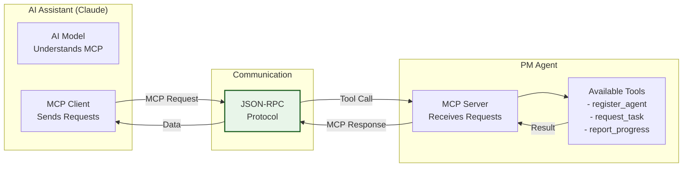
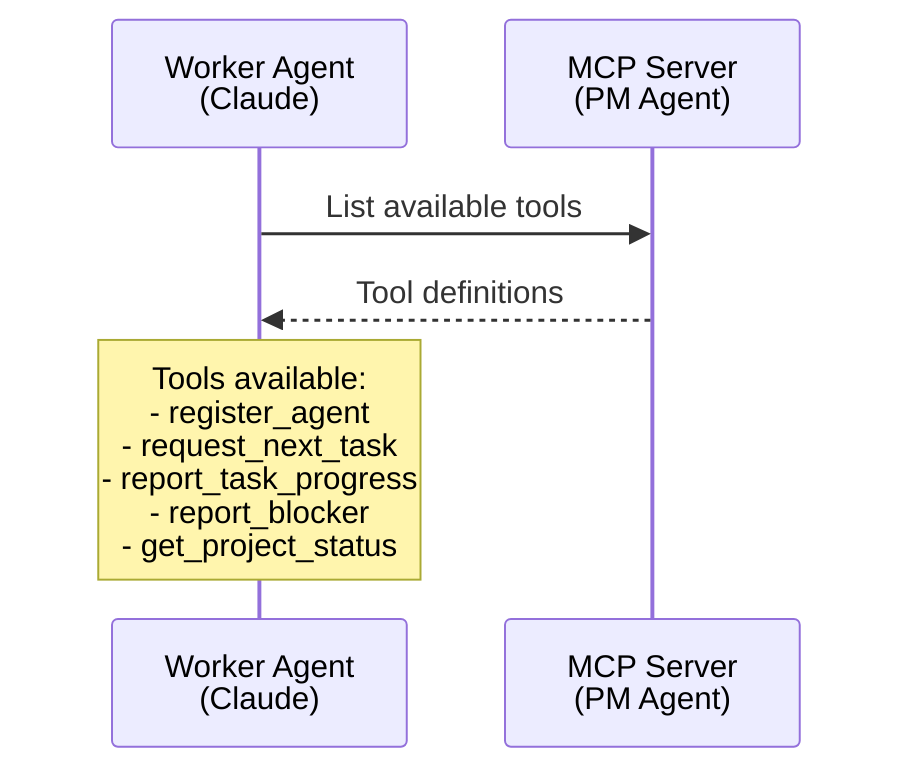

# Understanding MCP Protocol

> **Reading time**: 10 minutes  
> **Complexity**: Foundational

## Introduction

MCP (Model Context Protocol) is the communication standard that lets AI assistants like Claude work with external tools and systems. In PM Agent, it's the language Worker Agents use to talk to PM Agent - like a phone line that connects AI workers to their AI manager.

## The Big Picture

MCP is an open protocol developed by Anthropic that standardizes how AI models interact with tools and data sources. Think of it as the "HTTP of AI tools" - a common language that any AI can use to work with any compatible system.



## Core Concepts

### MCP Server

A program that exposes tools and resources to AI assistants. PM Agent runs an MCP server that Worker Agents can connect to.

**Example**: PM Agent's MCP server exposes tools like `register_agent`, `request_next_task`, and `report_task_progress` that Worker Agents can call.

### MCP Client

The AI assistant's ability to connect to and use MCP servers. Claude has built-in MCP client capabilities.

**In Practice**: When you configure Claude with PM Agent's connection details, Claude becomes a Worker Agent that can request and complete tasks.

### Tools

Specific functions that an MCP server makes available. Each tool has a name, description, and parameters - like function definitions in programming.

**Why It Matters**: Tools are how Worker Agents actually do things - they can't directly modify code or systems, only call tools that do the work.

## How It Works

### Step 1: Connection Setup

Worker Agents (Claude) connect to PM Agent's MCP server:

```json
{
    "mcpServers": {
        "pm-agent": {
            "command": "docker",
            "args": ["exec", "pm-agent", "python", "-m", "pm_agent"],
            "env": {
                "PYTHONPATH": "/app"
            }
        }
    }
}
```

### Step 2: Tool Discovery

When connected, the Worker Agent can see available tools:



### Step 3: Tool Invocation

Worker Agents call tools using JSON-RPC format:

```json
// Worker Agent sends:
{
    "jsonrpc": "2.0",
    "method": "tool/call",
    "params": {
        "name": "register_agent",
        "arguments": {
            "agent_id": "claude-worker-001",
            "name": "Backend Developer",
            "skills": ["python", "fastapi", "postgresql"]
        }
    },
    "id": 1
}

// PM Agent responds:
{
    "jsonrpc": "2.0",
    "result": {
        "success": true,
        "message": "Agent registered successfully"
    },
    "id": 1
}
```

### Step 4: Continuous Interaction

Worker Agents use MCP tools throughout their lifecycle:

```python
# 1. Register with PM Agent
register_agent({
    "agent_id": "worker-123",
    "skills": ["python", "api", "testing"]
})

# 2. Request work
task = request_next_task()
# Returns: {"id": "task-456", "title": "Build user API", ...}

# 3. Report progress
report_task_progress({
    "task_id": "task-456",
    "progress": 50,
    "message": "Completed API endpoints, starting tests"
})

# 4. Handle blockers
report_blocker({
    "task_id": "task-456",
    "description": "Database connection failing"
})
# Returns: {"suggestions": ["Check connection string", ...]}

# 5. Complete task
report_task_progress({
    "task_id": "task-456",
    "progress": 100,
    "message": "All tests passing, API complete"
})
```

## Real-World Analogy

MCP Protocol is like a restaurant's order system:

- **Waiter = Worker Agent (Claude)**: Takes orders and serves food
- **Kitchen = PM Agent**: Prepares orders and manages workflow  
- **Order Slips = MCP Messages**: Standardized communication
- **Menu = Available Tools**: What the kitchen can make

The process:
1. Waiter connects to kitchen (MCP connection)
2. Kitchen provides menu (tool discovery)
3. Waiter takes order (request_next_task)
4. Waiter updates customer (report_progress)
5. Waiter serves food (task completion)

Just like order slips have a standard format (table number, items, special requests), MCP messages follow a standard structure that both sides understand.

## Common Misconceptions

### Misconception 1: MCP is specific to PM Agent
**Reality**: MCP is an open standard by Anthropic. PM Agent is just one implementation. The same protocol works with many other tools and systems.

### Misconception 2: Worker Agents can do anything
**Reality**: Worker Agents can only use the tools exposed by the MCP server. They can't access systems or perform actions outside of these defined tools.

### Misconception 3: MCP is complicated to implement
**Reality**: MCP uses simple JSON-RPC messages. If you can parse JSON and call functions, you can implement MCP.

## When to Use MCP

Use MCP when:
- ✅ You need AI assistants to interact with external systems
- ✅ You want standardized tool interfaces
- ✅ Multiple AI models need to use the same tools
- ✅ You need clear boundaries for AI capabilities

Consider alternatives when:
- ❌ You need real-time streaming data
- ❌ Binary data transfer is required
- ❌ Microsecond latency is critical
- ❌ You need peer-to-peer communication

## Trade-offs and Alternatives

### Advantages
- **Standardized**: Works with any MCP-compatible AI
- **Secure**: Clear boundaries on what AI can do
- **Simple**: JSON-based, easy to debug
- **Flexible**: Easy to add new tools

### Limitations
- **Request-Response Only**: No streaming or real-time updates
- **Text-Based**: Not efficient for binary data
- **Single Connection**: One AI per MCP server instance
- **No State**: Each request is independent

### Alternatives
- **REST APIs**: More universal but less AI-specific
- **Function Calling**: Model-specific, not standardized
- **Direct Code Execution**: Powerful but dangerous
- **Custom Protocols**: More control but more work

## In Practice

### Example Scenario

Here's a complete Worker Agent session using MCP:

```typescript
// Worker Agent (Claude) perspective
async function workOnTasks() {
    // 1. Introduce myself to PM Agent
    await mcp.callTool("register_agent", {
        agent_id: "claude-backend-01",
        name: "Backend Specialist",
        skills: ["python", "django", "postgresql", "redis"],
        capacity: 2
    });
    
    // 2. Start work loop
    while (true) {
        // Request a task
        const task = await mcp.callTool("request_next_task", {});
        
        if (!task) {
            console.log("No tasks available, waiting...");
            await sleep(30000);
            continue;
        }
        
        console.log(`Got task: ${task.title}`);
        
        // Work on the task
        try {
            // Report starting
            await mcp.callTool("report_task_progress", {
                task_id: task.id,
                progress: 0,
                message: "Starting work on task"
            });
            
            // Do actual work (write code, run tests, etc.)
            await implementTask(task);
            
            // Report progress
            await mcp.callTool("report_task_progress", {
                task_id: task.id,
                progress: 50,
                message: "Implementation complete, running tests"
            });
            
            // Run tests
            await runTests();
            
            // Report completion
            await mcp.callTool("report_task_progress", {
                task_id: task.id,
                progress: 100,
                message: "All tests passing, task complete"
            });
            
        } catch (error) {
            // Report blocker
            const help = await mcp.callTool("report_blocker", {
                task_id: task.id,
                description: error.message
            });
            
            console.log(`Got help: ${help.suggestions}`);
            // Try to resolve and continue...
        }
    }
}
```

### Code Example

Here's how PM Agent implements its MCP server:

```python
# PM Agent's MCP Server Implementation
class PMAgentMCPServer:
    def __init__(self):
        self.tools = {
            "register_agent": self.handle_register_agent,
            "request_next_task": self.handle_request_task,
            "report_task_progress": self.handle_report_progress,
            "report_blocker": self.handle_report_blocker,
            "get_project_status": self.handle_get_status
        }
    
    async def handle_tool_call(self, tool_name: str, arguments: dict):
        """Route MCP tool calls to appropriate handlers"""
        if tool_name not in self.tools:
            raise ValueError(f"Unknown tool: {tool_name}")
        
        handler = self.tools[tool_name]
        return await handler(arguments)
    
    async def handle_register_agent(self, args: dict):
        """Register a new worker agent"""
        agent = Agent(
            id=args["agent_id"],
            name=args["name"],
            skills=args["skills"],
            capacity=args.get("capacity", 1)
        )
        
        self.agent_manager.register(agent)
        
        return {
            "success": True,
            "message": f"Agent {agent.name} registered successfully"
        }
    
    async def handle_request_task(self, args: dict):
        """Assign next appropriate task to requesting agent"""
        agent_id = args.get("agent_id")
        agent = self.agent_manager.get_agent(agent_id)
        
        # Use AI to find best task match
        task = await self.task_manager.find_best_task_for_agent(agent)
        
        if task:
            await self.task_manager.assign_task(task.id, agent_id)
            return task.to_dict()
        else:
            return None
```

## Going Deeper

Ready to learn more? Explore:
- 📚 [MCP Official Documentation](https://modelcontextprotocol.io) - Complete protocol specification
- 🔧 [Creating MCP Tools](/how-to/create-mcp-tools) - Build your own tools
- 📖 [PM Agent Tools Reference](/reference/mcp-tools-api) - All available PM Agent tools

## Summary

MCP Protocol is the standardized communication layer that enables Worker Agents to interact with PM Agent. It provides a secure, simple, and flexible way for AI assistants to use tools and complete tasks while maintaining clear boundaries on capabilities.

## Further Reading

- [Worker Agents Concept](/concepts/worker-agents)
- [MCP Protocol Specification](https://modelcontextprotocol.io/docs)
- [JSON-RPC 2.0 Specification](https://www.jsonrpc.org/specification)
- [Building MCP Servers Guide](https://modelcontextprotocol.io/docs/guides/building-servers)