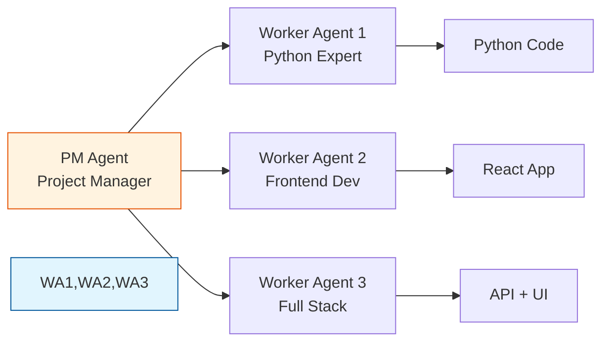
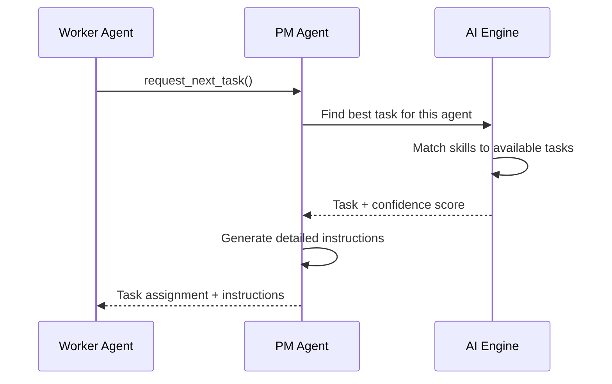

# Understanding Worker Agents

> **Reading time**: 10 minutes  
> **Complexity**: Foundational

## Introduction

Worker Agents are the AI-powered developers that actually build your software in PM Agent. They're autonomous AI systems (like Claude) that can write code, run tests, fix bugs, and complete development tasks - all while being managed by PM Agent.

## The Big Picture

Think of PM Agent as a software development company where Worker Agents are the developers. PM Agent acts as the project manager, assigning tasks, tracking progress, and helping when workers get stuck. Each Worker Agent has its own skills, works independently, and communicates through a standardized protocol.



## Core Concepts

### Worker Agent

An autonomous AI system that can understand tasks, write code, and report progress. Each worker agent is essentially an AI assistant (like Claude) configured to work on software development tasks.

**Example**: A Claude instance using PM Agent's MCP tools to build a REST API based on task requirements.

### Agent Skills

The capabilities and expertise areas that a Worker Agent declares when registering. These help PM Agent assign the right tasks to the right workers.

**In Practice**: A worker might declare skills like `["python", "fastapi", "postgresql", "testing"]`, making it ideal for backend API tasks.

### Agent Lifecycle

The stages a Worker Agent goes through from startup to task completion: Registration → Idle → Working → Reporting → Idle (repeat).

**Why It Matters**: Understanding the lifecycle helps you debug issues and optimize agent performance.

## How It Works

### Step 1: Agent Registration

When a Worker Agent starts up, it introduces itself to PM Agent:

```python
# What happens inside a Worker Agent
agent_info = {
    "agent_id": "agent-001",
    "name": "Backend Specialist",
    "skills": ["python", "django", "postgresql", "redis"],
    "capacity": 3  # Can handle 3 concurrent tasks
}
pm_agent.register_agent(agent_info)
```

PM Agent stores this profile and uses it for intelligent task assignment.

### Step 2: Task Request and Assignment

The Worker Agent asks for work, and PM Agent finds the best match:



### Step 3: Autonomous Work

Once assigned, the Worker Agent works independently:

1. **Understands the task** - Reads requirements and instructions
2. **Plans the approach** - Decides what files to create/modify
3. **Implements the solution** - Writes code, creates tests
4. **Validates the work** - Runs tests, checks for errors
5. **Reports progress** - Updates PM Agent at milestones

### Step 4: Progress Reporting

Workers keep PM Agent informed throughout the process:

```python
# Progress milestones
report_task_progress(task_id, 25, "Created database models")
report_task_progress(task_id, 50, "Implemented API endpoints")
report_task_progress(task_id, 75, "Added unit tests")
report_task_progress(task_id, 100, "All tests passing, task complete")
```

### Step 5: Handling Blockers

When stuck, workers can ask for help:

```python
# Worker encounters an issue
report_blocker(
    task_id,
    "Cannot connect to PostgreSQL database on localhost:5432"
)

# PM Agent provides AI-generated solutions
# Worker receives suggestions and continues
```

## Real-World Analogy

Worker Agents in PM Agent are like contractors in a construction company:

- **PM Agent = General Contractor**: Manages the overall project, assigns work
- **Worker Agents = Specialized Contractors**: Electricians, plumbers, carpenters
- **Task Board = Work Orders**: Specific jobs to be completed
- **MCP Protocol = Radio Communication**: How workers and manager stay in sync

Just like specialized contractors:
- Each has specific skills (electrical, plumbing, carpentry)
- They work independently once assigned
- They report progress and problems
- They move to the next job when done

## Common Misconceptions

### Misconception 1: Worker Agents can see each other's work
**Reality**: Worker Agents are completely isolated. They can't directly communicate or see what others are building. PM Agent provides context when needed.

### Misconception 2: Worker Agents need constant supervision
**Reality**: Once assigned a task, Worker Agents work autonomously. They only check in at progress milestones or when blocked.

### Misconception 3: All Worker Agents are the same
**Reality**: Each Worker Agent can have different skills, capabilities, and even different AI models powering them.

## When to Use Worker Agents

Use Worker Agents when:
- ✅ You have well-defined development tasks
- ✅ Tasks can be worked on independently
- ✅ You want parallel development progress
- ✅ You need different skill sets for different tasks

Avoid using them when:
- ❌ Tasks require real-time collaboration
- ❌ Work needs human creativity or design decisions
- ❌ Tasks involve sensitive data or systems

## Trade-offs and Alternatives

### Advantages
- **Parallel Development**: Multiple agents can work simultaneously
- **24/7 Availability**: AI agents don't need breaks
- **Consistent Quality**: Follow instructions precisely
- **No Context Switching**: Each agent focuses on one task

### Limitations
- **No Direct Collaboration**: Agents can't pair program
- **Limited Creativity**: Best for well-defined tasks
- **Requires Clear Instructions**: Ambiguous tasks may cause issues
- **API Costs**: Each agent uses AI API calls

### Alternatives
- **Single AI Assistant**: Use one AI for all tasks (slower but simpler)
- **Human Developers**: Better for creative or ambiguous work
- **Hybrid Approach**: Humans define architecture, agents implement

## In Practice

### Example Scenario
Let's say you're building a todo app with PM Agent:

1. **Frontend Agent** gets assigned "Create React todo list component"
2. **Backend Agent** gets assigned "Build REST API for todos"
3. **Database Agent** gets assigned "Set up PostgreSQL schema"

Each agent works independently:
- Frontend Agent creates components without knowing API details
- Backend Agent builds standard REST endpoints
- Database Agent sets up tables following best practices

PM Agent ensures they're building compatible pieces through task instructions.

### Code Example
Here's what a Worker Agent conversation might look like:

```python
# Worker Agent registers itself
pm_agent.register_agent({
    "agent_id": "backend-expert-001",
    "name": "API Builder",
    "skills": ["python", "fastapi", "rest", "testing"]
})

# Worker requests a task
task = pm_agent.request_next_task()
# Returns: {
#   "id": "task-123",
#   "title": "Create user authentication API",
#   "instructions": "Build JWT-based auth with /login, /logout, /refresh endpoints..."
# }

# Worker reports progress
pm_agent.report_task_progress("task-123", 25, "Created user model and database schema")
pm_agent.report_task_progress("task-123", 50, "Implemented JWT token generation")

# Worker hits a blocker
response = pm_agent.report_blocker(
    "task-123", 
    "Redis connection refused for session storage"
)
# PM Agent suggests: "Try using in-memory storage for development..."

# Worker completes task
pm_agent.report_task_progress("task-123", 100, "Auth API complete with tests")
```

## Going Deeper

Ready to learn more? Explore:
- 📚 [MCP Protocol](/concepts/mcp-protocol) - How agents communicate
- 🔧 [Task Assignment Intelligence](/concepts/task-assignment) - How PM Agent matches tasks
- 📖 [Creating Custom Workers](/how-to/create-worker-agent) - Build your own Worker Agent

## Summary

Worker Agents are the autonomous AI developers that bring your projects to life in PM Agent. They register their skills, request tasks, work independently, and report progress - all coordinated by PM Agent's intelligent task management.

## Further Reading

- [PM Agent Architecture](/reference/architecture)
- [Worker Agent API Reference](/reference/worker-api)
- [Best Practices for Worker Agents](/how-to/worker-best-practices)
- [MCP (Model Context Protocol) Specification](https://modelcontextprotocol.io)