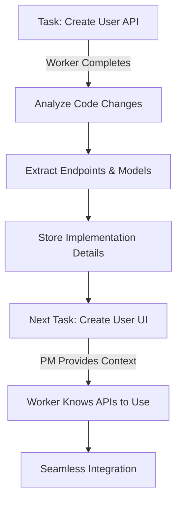

# Code-Aware Project Management

This document explains how PM Agent uses GitHub integration to provide code-aware project management, enabling intelligent task coordination based on actual code implementations.

## Overview

When using GitHub as the kanban provider, PM Agent gains the ability to:

1. **Analyze completed work** - Understand what was implemented when tasks are completed
2. **Provide context to workers** - Share relevant APIs, models, and implementations with new workers
3. **Track code evolution** - Monitor how the codebase grows with each task
4. **Enable seamless handoffs** - Workers know exactly what interfaces to use

## How It Works

### 1. Task Completion Analysis

When a worker completes a task (e.g., "Create API endpoints"), PM Agent:

```python
# Worker completes task
await report_task_progress(
    task_id="123",
    status="completed",
    progress=100,
    message="API endpoints implemented"
)
```

PM Agent then:
1. Analyzes recent commits and PRs by the worker
2. Extracts implemented features (endpoints, models, etc.)
3. Stores this knowledge for future tasks

### 2. Intelligent Task Instructions

When assigning the next task (e.g., "Create frontend UI"), PM Agent includes:

```markdown
## Previous Implementation Context:

### Existing API Endpoints:
- POST /api/users/register
- POST /api/users/login
- GET /api/users/profile
- PUT /api/users/profile

### Recommendations from Previous Work:
- Frontend developers should use the implemented endpoints
- Check the PR for request/response formats
- Authentication uses JWT tokens in Authorization header
```

### 3. Code Analysis Features

The `CodeAnalyzer` component extracts:

#### API Endpoints
```python
# Detects patterns like:
@app.post("/api/users/register")
router.get("/api/products")
app.route("/api/orders", methods=["GET", "POST"])
```

#### Data Models
```python
# Detects patterns like:
class User(Base):  # SQLAlchemy
interface UserProfile {  # TypeScript
public class Product {  // Java
```

#### Configuration Changes
- Environment variables
- Database schemas
- Service configurations

## Use Cases

### Scenario 1: API → Frontend Handoff

1. **Backend Developer** completes "Implement user authentication API"
   - Creates `/api/auth/login`, `/api/auth/register`, `/api/auth/logout`
   - Implements JWT token authentication

2. **PM Agent** analyzes the implementation:
   ```json
   {
     "endpoints": [
       {"method": "POST", "path": "/api/auth/login"},
       {"method": "POST", "path": "/api/auth/register"},
       {"method": "POST", "path": "/api/auth/logout"}
     ],
     "recommendations": [
       "Use JWT tokens in Authorization header",
       "Login returns {token, user} object",
       "Register requires {email, password, name}"
     ]
   }
   ```

3. **Frontend Developer** receives task with context:
   - Knows exact endpoints to call
   - Understands authentication flow
   - Has request/response formats

### Scenario 2: Model → API Integration

1. **Database Developer** completes "Create product data model"
   - Implements `Product`, `Category`, `Inventory` models

2. **API Developer** gets next task with:
   - List of available models
   - Field definitions
   - Relationships between models

### Scenario 3: Feature Evolution Tracking

1. PM Agent tracks feature growth:
   - v1: Basic CRUD endpoints
   - v2: Added filtering and pagination
   - v3: Added batch operations

2. New developers understand the evolution and can extend appropriately

## Configuration

### Environment Variables

```bash
# Enable GitHub code awareness
KANBAN_PROVIDER=github
GITHUB_TOKEN=your_token
GITHUB_OWNER=your_username
GITHUB_REPO=your_repo

# Optional: Specific branch tracking
GITHUB_BRANCH=main
```

### Task Naming Conventions

For best results, use clear task names:

- ✅ "Implement user authentication API endpoints"
- ✅ "Create React components for user profile"
- ✅ "Design database schema for products"
- ❌ "Fix stuff"
- ❌ "Update code"

## Benefits

### 1. Reduced Communication Overhead
- Workers don't need to ask "What endpoints should I use?"
- PM Agent provides the answers automatically

### 2. Faster Onboarding
- New workers immediately understand existing implementations
- No need to dig through code to find interfaces

### 3. Better Integration
- Frontend/backend integration is seamless
- Services know exactly how to communicate

### 4. Quality Improvement
- Consistency across implementations
- Best practices propagated automatically

## Technical Implementation

### Code Analyzer

```python
class CodeAnalyzer:
    def analyze_task_completion(task, worker, owner, repo):
        # 1. Get recent commits/PRs
        # 2. Extract implementations
        # 3. Generate recommendations
        
    def get_implementation_details(owner, repo, feature_type):
        # Search for specific implementations
        # Return structured data
```

### AI Enhancement

```python
class AIAnalysisEngine:
    def generate_task_instructions(task, agent, previous_implementations):
        # Include context from previous work
        # Tailor instructions to build on existing code
```

## Future Enhancements

1. **Dependency Graph** - Automatically understand code dependencies
2. **Test Coverage** - Track which features have tests
3. **Documentation Links** - Connect code to documentation
4. **Performance Metrics** - Track API response times
5. **Breaking Change Detection** - Alert when changes might break other components

## Example Workflow



## Best Practices

1. **Commit Messages** - Use clear, descriptive commit messages
2. **PR Descriptions** - Document API contracts in PR descriptions
3. **Code Comments** - Add comments for complex implementations
4. **Consistent Patterns** - Follow established patterns in the codebase
5. **Test Everything** - Include tests to show usage examples

## Conclusion

Code-aware project management bridges the gap between task management and actual implementation, creating a more intelligent and efficient development workflow. By understanding what's been built, PM Agent can provide better guidance for what comes next.