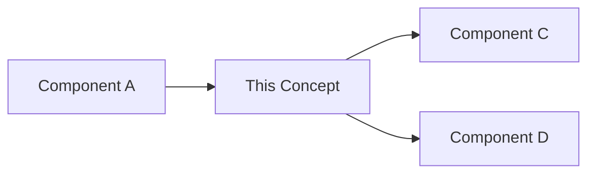

# Understanding [Concept Name]

> **Reading time**: [X minutes]  
> **Complexity**: Foundational | Intermediate | Advanced

## Introduction

[High-level introduction to the concept in 2-3 sentences. Why does this matter?]

## The Big Picture

[Explain how this concept fits into the broader PM Agent system. Use analogies if helpful.]



## Core Concepts

### [Key Term 1]

[Definition and explanation]

**Example**: [Concrete example of this term in action]

### [Key Term 2]

[Definition and explanation]

**In Practice**: [How this manifests in PM Agent]

### [Key Term 3]

[Definition and explanation]

**Why It Matters**: [The implications of this concept]

## How It Works

### Step 1: [First Part of Process]

[Detailed explanation with visuals if helpful]

```
[Diagram or code showing the concept]
```

### Step 2: [Next Part]

[Continue breaking down the concept]

### Step 3: [Final Part]

[Complete the explanation]

## Real-World Analogy

[Use a familiar analogy to explain the concept]

For example, [concept] is like [familiar thing] because:
- [Similarity 1]
- [Similarity 2]
- [Similarity 3]

## Common Misconceptions

### Misconception 1: [False Belief]
**Reality**: [Correct understanding]

### Misconception 2: [Another False Belief]
**Reality**: [Correct understanding]

## When to Use This

Use [concept] when:
- ✅ [Appropriate scenario 1]
- ✅ [Appropriate scenario 2]
- ✅ [Appropriate scenario 3]

Avoid using it when:
- ❌ [Inappropriate scenario 1]
- ❌ [Inappropriate scenario 2]

## Trade-offs and Alternatives

### Advantages
- **Pro 1**: [Benefit with explanation]
- **Pro 2**: [Another benefit]
- **Pro 3**: [Additional benefit]

### Limitations
- **Con 1**: [Drawback with context]
- **Con 2**: [Another limitation]

### Alternatives
- **[Alternative 1]**: Better when [specific condition]
- **[Alternative 2]**: Consider for [different scenario]

## In Practice

### Example Scenario
[Walk through a practical scenario where this concept applies]

### Code Example
```python
# Demonstration of the concept
# [Code showing the concept in action]
```

## Going Deeper

Ready to learn more? Explore:
- 📚 [Advanced Concept](/concepts/advanced-topic)
- 🔧 [How to Apply This](/how-to/implement-concept)
- 📖 [Technical Reference](/reference/concept-api)

## Summary

[2-3 sentence summary reinforcing the key points]

## Further Reading

- [Internal Link 1]
- [Internal Link 2]
- [External Resource](https://example.com)
- [Academic Paper or Specification]