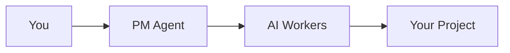

# Getting Started with [Component]

> **Time to first success**: [X minutes]  
> **What you'll achieve**: [Specific outcome]

## Choose Your Path

<div class="path-selector">

### 🚀 I want to try it quickly
→ [Jump to Quick Start](#quick-start)

### 📚 I want to understand first  
→ [Read the Overview](#overview)

### 🛠️ I'm ready for production
→ [Go to Full Installation](#full-installation)

</div>

## Quick Start

Get up and running in 60 seconds:

```bash
# One command to rule them all
curl -sSL https://get.pm-agent.ai | bash
```

That's it! You now have PM Agent running locally. Try:
```bash
pm-agent demo
```

## Overview

### What is [Component]?

[2-3 sentence explanation in simple terms]

### Why Use It?

- **Benefit 1**: [Specific advantage]
- **Benefit 2**: [Another advantage]
- **Benefit 3**: [Additional benefit]

### How It Works



## Full Installation

### System Requirements

- **OS**: Linux, macOS, or Windows 10+
- **Python**: 3.8 or higher
- **Memory**: 4GB RAM minimum
- **Disk**: 1GB free space

### Step 1: Install Dependencies

<tabs>
<tab label="macOS">

```bash
brew install python@3.11
pip install --upgrade pip
```

</tab>
<tab label="Linux">

```bash
sudo apt update
sudo apt install python3.11 python3-pip
```

</tab>
<tab label="Windows">

```powershell
# Install Python from python.org
# Then in PowerShell:
python -m pip install --upgrade pip
```

</tab>
</tabs>

### Step 2: Install PM Agent

```bash
pip install pm-agent
```

### Step 3: Configure Your Environment

Create a `.env` file:
```bash
# Required
ANTHROPIC_API_KEY=your-api-key

# Choose your task board
KANBAN_PROVIDER=github  # or 'linear' or 'planka'
```

### Step 4: Verify Installation

```bash
pm-agent --version
pm-agent doctor  # Checks your setup
```

## Your First Project

### 1. Initialize PM Agent

```bash
pm-agent init my-first-project
cd my-first-project
```

### 2. Create Your First Task

```bash
pm-agent task create "Build a hello world API"
```

### 3. Start an AI Worker

```bash
pm-agent worker start
```

### 4. Watch the Magic

Your AI worker will:
1. Pick up the task
2. Create the API code
3. Report progress
4. Complete the task

## What's Next?

### Learn More
- 📖 [Core Concepts](/concepts/core-concepts) - Understand how PM Agent works
- 🎓 [Todo App Tutorial](/tutorials/beginner/todo-app) - Build something real
- 🔧 [Configuration Guide](/reference/configuration) - Customize your setup

### Get Help
- 💬 [Join our Discord](https://discord.gg/pm-agent)
- 🐛 [Report Issues](https://github.com/lwgray/pm-agent/issues)
- 📧 [Email Support](mailto:support@pm-agent.ai)

## Troubleshooting Quick Fixes

### "API Key not found"
```bash
export ANTHROPIC_API_KEY=your-key-here
# Or add to .env file
```

### "Port already in use"
```bash
pm-agent --port 3101
```

### "Workers not picking up tasks"
```bash
pm-agent worker list  # Check worker status
pm-agent task list    # Verify tasks exist
```

---

🎉 **Welcome to PM Agent!** You're ready to build amazing things with AI-powered development.