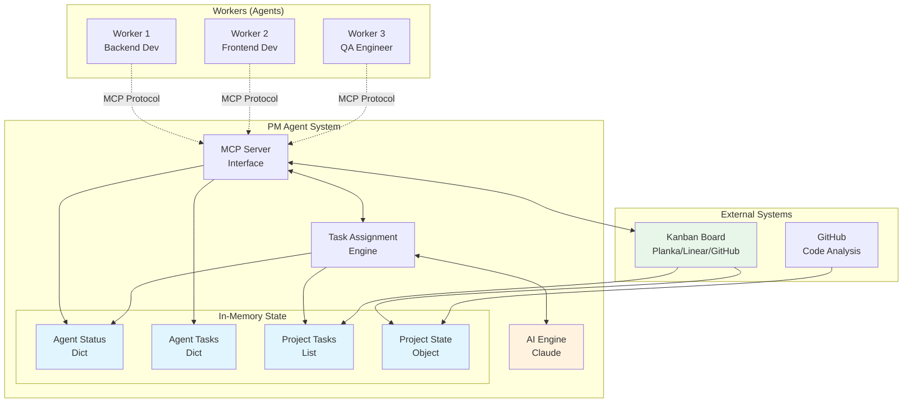
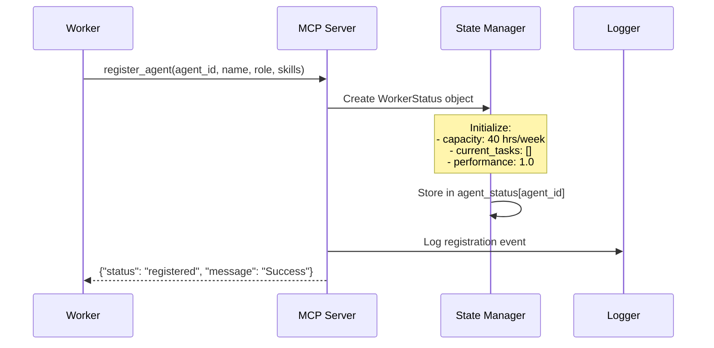
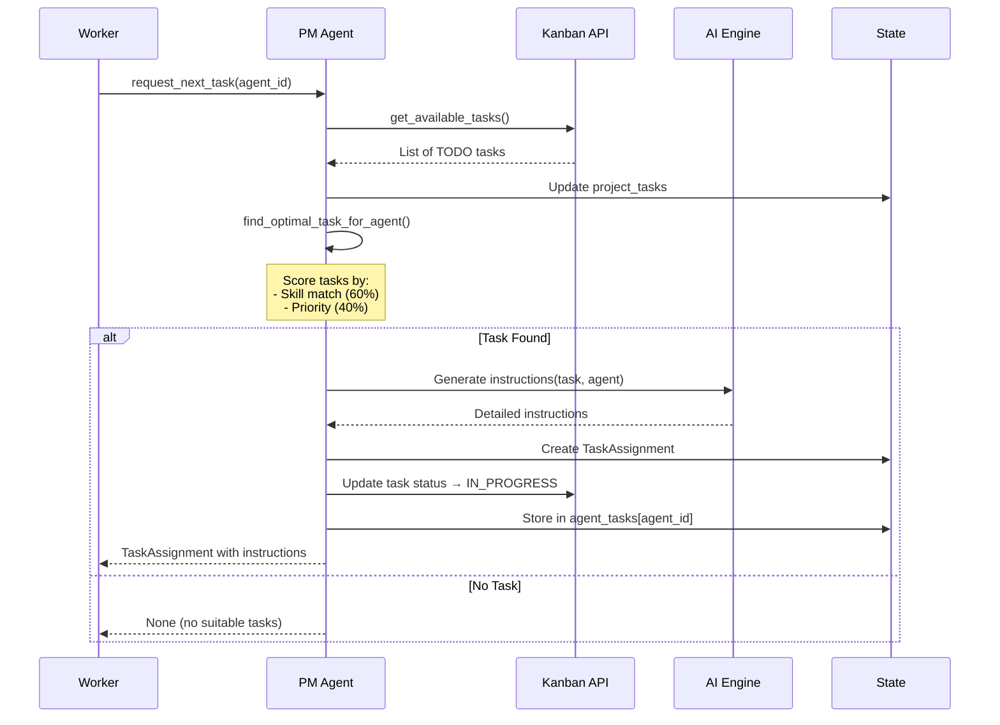
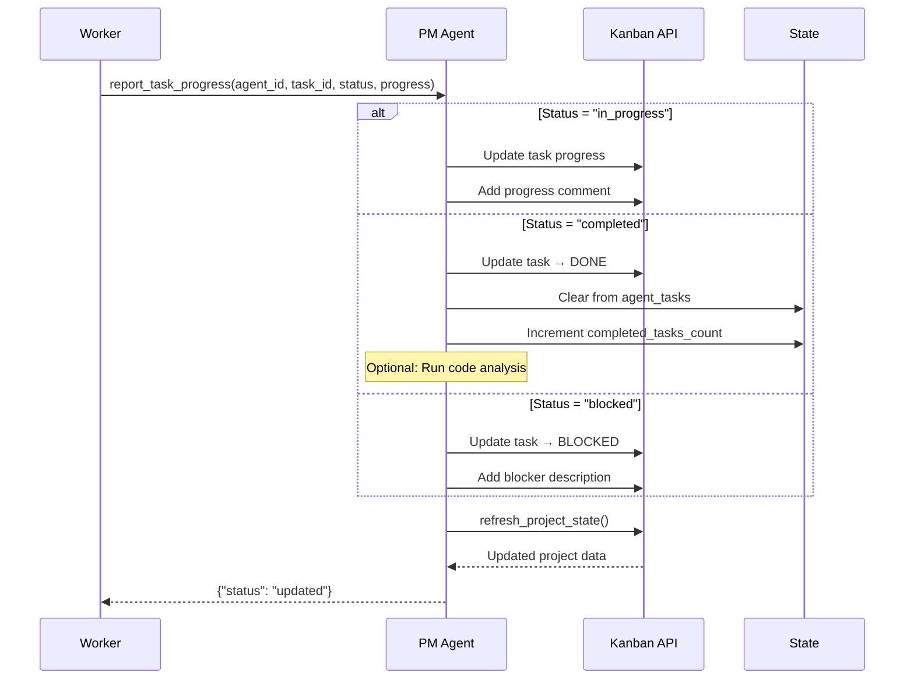
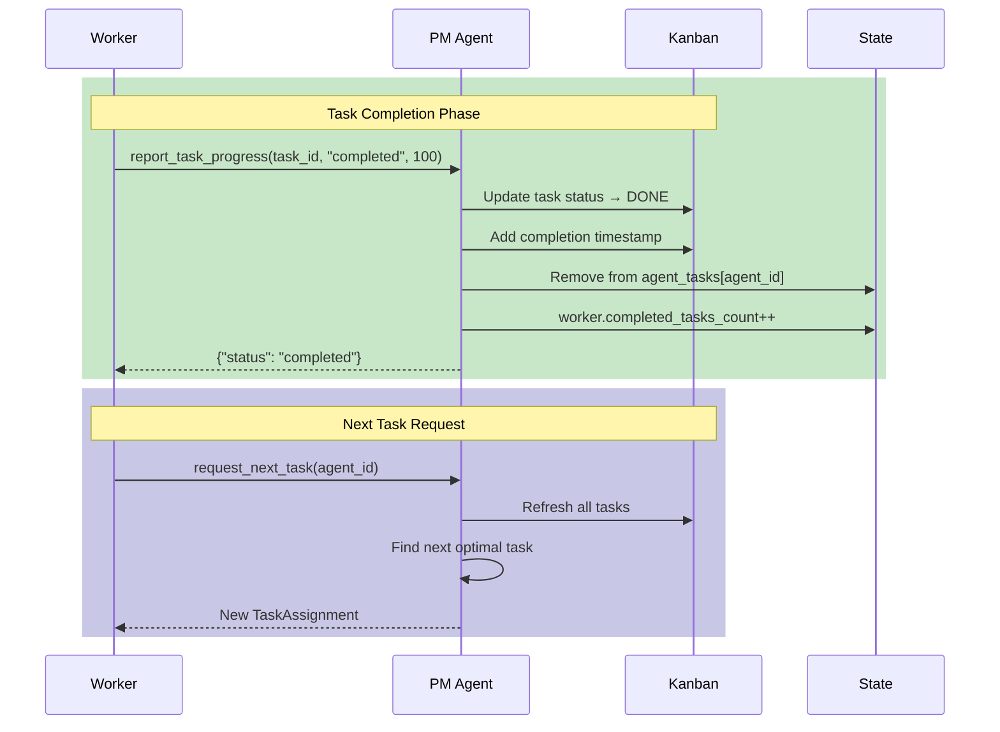
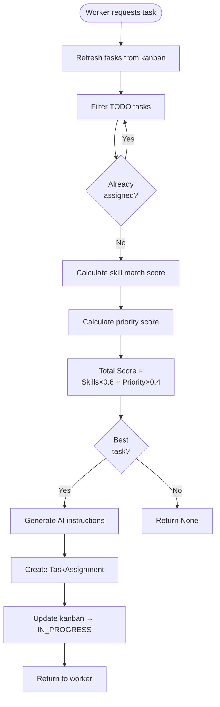

# PM Agent Architecture & Workflows

## System Architecture



## Data Flow: How PM Agent Remembers Tasks

```mermaid
graph LR
    subgraph "Task Memory System"
        KB[Kanban Board<br/>Source of Truth]
        PM[PM Agent<br/>In-Memory Cache]
        
        KB -->|refresh_project_state()| PM
        PM -->|update_task()| KB
    end
    
    subgraph "State Components"
        PT[project_tasks<br/>All tasks from kanban]
        AT[agent_tasks<br/>Current assignments]
        AS[agent_status<br/>Worker info]
    end
    
    PM --> PT & AT & AS
    
    Note1[No Persistence!<br/>State rebuilt from<br/>kanban on restart]
    
    style KB fill:#4caf50
    style PM fill:#2196f3
    style Note1 fill:#ffeb3b
```

## Workflow 1: Worker Registration



## Workflow 2: Requesting Work



## Workflow 3: Progress Reporting



## Workflow 4: Task Completion



## Task Assignment Algorithm



## Key Design Principles

1. **Stateless Operation**: PM Agent doesn't persist state between restarts
2. **Kanban as Database**: All task data lives in the kanban system
3. **Real-time Refresh**: State is refreshed from kanban on every operation
4. **AI-Powered Instructions**: Claude generates context-aware task instructions
5. **Skill-Based Assignment**: Tasks matched to workers based on skills and priority
6. **Autonomous Workers**: Workers operate independently without coordination