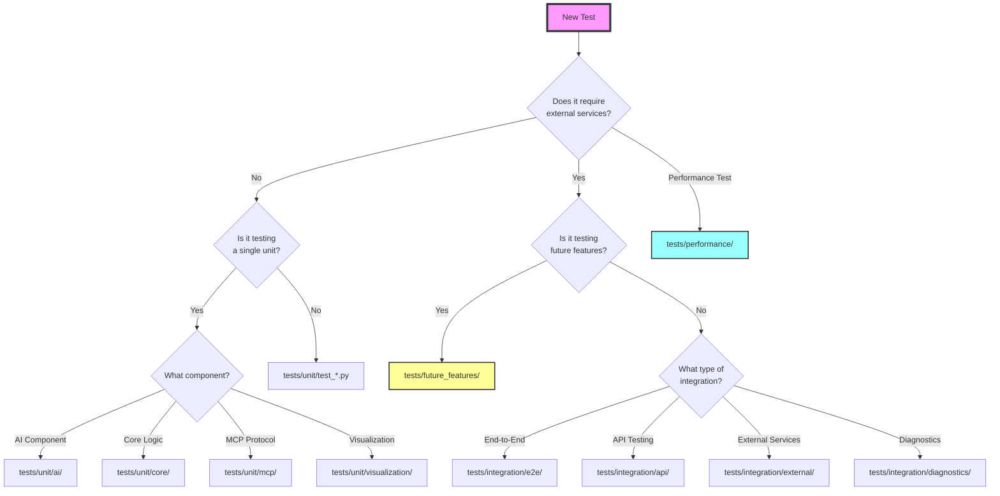

# Test Writing Guide for Marcus

## 🎯 Test Writing Prompt Template

When writing a new test, ask yourself these questions in order:

### 1. **What am I testing?**
```
I am testing: [Component/Feature Name]
Type: [ ] Function [ ] Class [ ] API Endpoint [ ] Integration [ ] Workflow
Purpose: [What should this component do?]
```

### 2. **What are the test requirements?**
```
Dependencies:
- [ ] No external dependencies (pure logic)
- [ ] Needs mocking of: _______________
- [ ] Requires real service: _______________
- [ ] Needs file system access
- [ ] Requires network access

Execution Time:
- [ ] < 100ms (fast unit test)
- [ ] < 1 second (slower unit test)
- [ ] > 1 second (integration/performance test)

Test Scope:
- [ ] Single function/method
- [ ] Single class
- [ ] Multiple components
- [ ] Full workflow/scenario
```

### 3. **What should I verify?**
```
Success Cases:
- [ ] Normal input → expected output
- [ ] Edge cases (empty, null, max values)
- [ ] Different valid input variations

Failure Cases:
- [ ] Invalid input → proper error
- [ ] Missing dependencies → graceful failure
- [ ] Service failures → proper handling

Side Effects:
- [ ] State changes
- [ ] External calls made
- [ ] Events emitted
- [ ] Files created/modified
```

## 🌳 Test Placement Decision Tree



## 📝 Decision Flow (Text Version)

```
START: I need to write a test

1. Does your test require external services (DB, API, Network)?
   ├─ NO → Go to 2
   └─ YES → Go to 5

2. Is it testing a single function/class in isolation?
   ├─ YES → Go to 3
   └─ NO → Place in: tests/unit/test_[feature_name].py

3. What component are you testing?
   ├─ AI/ML Logic → tests/unit/ai/test_[component].py
   ├─ Core Models/Logic → tests/unit/core/test_[component].py
   ├─ MCP Protocol → tests/unit/mcp/test_[component].py
   └─ UI/Visualization → tests/unit/visualization/test_[component].py

4. DONE! Write your unit test.

5. Is this testing unimplemented features (TDD)?
   ├─ YES → tests/future_features/[module]/test_[feature].py
   └─ NO → Go to 6

6. What type of integration test?
   ├─ Full workflow → tests/integration/e2e/test_[workflow].py
   ├─ API endpoints → tests/integration/api/test_[endpoint].py
   ├─ External service → tests/integration/external/test_[service].py
   ├─ Debugging/Diagnostic → tests/integration/diagnostics/test_[diagnostic].py
   └─ Performance/Load → tests/performance/test_[metric].py

7. DONE! Write your integration test.
```

## 🎨 Test File Naming Conventions

### Unit Tests
```python
# Pattern: test_[what_you're_testing].py

tests/unit/core/test_models.py          # Testing data models
tests/unit/core/test_workspace_manager.py # Testing a specific manager
tests/unit/ai/test_health_monitor.py    # Testing health monitoring
tests/unit/mcp/test_marcus_server.py    # Testing server functionality
```

### Integration Tests
```python
# Pattern: test_[workflow/integration]_[description].py

tests/integration/e2e/test_project_lifecycle.py     # Full project workflow
tests/integration/api/test_kanban_integration.py    # API integration
tests/integration/external/test_github_sync.py      # External service
tests/integration/diagnostics/test_connection.py    # Connection diagnostics
```

### Performance Tests
```python
# Pattern: test_[metric]_performance.py or benchmark_[feature].py

tests/performance/test_task_assignment_performance.py
tests/performance/benchmark_ai_response_time.py
tests/performance/test_concurrent_agents_load.py
```

## 📋 Test Structure Template

### Unit Test Template
```python
"""
Unit tests for [Component Name]

Tests [what this tests] in isolation with all external dependencies mocked.
"""

import pytest
from unittest.mock import Mock, AsyncMock, patch
from src.module.component import ComponentUnderTest


class TestComponentName:
    """Test suite for ComponentName"""
    
    @pytest.fixture
    def mock_dependency(self):
        """Mock external dependency"""
        dep = Mock()
        dep.some_method = AsyncMock(return_value="expected")
        return dep
    
    @pytest.fixture
    def component(self, mock_dependency):
        """Create component instance with mocked dependencies"""
        return ComponentUnderTest(dependency=mock_dependency)
    
    def test_normal_operation(self, component):
        """Test component under normal conditions"""
        # Arrange
        input_data = {"key": "value"}
        
        # Act
        result = component.process(input_data)
        
        # Assert
        assert result.success is True
        assert result.data == "expected output"
    
    def test_handles_invalid_input(self, component):
        """Test component handles invalid input gracefully"""
        # Arrange
        invalid_input = None
        
        # Act & Assert
        with pytest.raises(ValueError, match="Input cannot be None"):
            component.process(invalid_input)
    
    @pytest.mark.asyncio
    async def test_async_operation(self, component, mock_dependency):
        """Test async operations"""
        # Arrange
        mock_dependency.async_method.return_value = "async result"
        
        # Act
        result = await component.async_process()
        
        # Assert
        assert result == "async result"
        mock_dependency.async_method.assert_called_once()
```

### Integration Test Template
```python
"""
Integration tests for [Feature/Workflow Name]

Tests [what this tests] with real service connections.
Requires: [list required services]
"""

import pytest
import asyncio
from tests.utils.base import IntegrationTestBase


@pytest.mark.integration
class TestFeatureIntegration(IntegrationTestBase):
    """Integration tests for [Feature]"""
    
    @pytest.fixture(scope="class")
    async def setup_services(self):
        """Setup required services for testing"""
        # Start required services
        kanban = await self.start_kanban_server()
        yield {"kanban": kanban}
        # Cleanup
        await self.stop_kanban_server()
    
    @pytest.mark.asyncio
    async def test_full_workflow(self, setup_services):
        """Test complete workflow from start to finish"""
        # This test actually connects to services
        pass
```

## 🏷️ Test Markers

Use these pytest markers to categorize your tests:

```python
@pytest.mark.unit          # Fast, isolated unit test
@pytest.mark.integration   # Requires external services  
@pytest.mark.slow          # Takes more than 1 second
@pytest.mark.performance   # Performance benchmark
@pytest.mark.kanban        # Requires Kanban MCP server
@pytest.mark.asyncio       # Async test
@pytest.mark.anyio         # Works with any async backend
```

## ✅ Quick Decision Checklist

Before writing your test, check:

- [ ] **Unit test?** → No external dependencies, mocks everything, < 100ms
- [ ] **Integration test?** → Tests real services, may be slower, requires setup
- [ ] **Performance test?** → Measures speed/memory/load capacity
- [ ] **Future feature?** → TDD test for unimplemented functionality

Then place it in the appropriate directory following the decision tree above!

## 🔧 Common Scenarios

### Scenario 1: Testing a new AI analysis function
```
Q: External services? → No (will mock the AI client)
Q: Single unit? → Yes (one function)
Q: Component? → AI Component
→ Place in: tests/unit/ai/test_[analysis_function].py
```

### Scenario 2: Testing Marcus-to-Kanban workflow
```
Q: External services? → Yes (needs real Kanban)
Q: Future feature? → No (testing existing)
Q: Integration type? → End-to-end workflow
→ Place in: tests/integration/e2e/test_marcus_kanban_workflow.py
```

### Scenario 3: Testing task assignment speed
```
Q: Performance test? → Yes
→ Place in: tests/performance/test_task_assignment_performance.py
```

### Scenario 4: Testing new LLM provider (not built yet)
```
Q: External services? → Yes (LLM API)
Q: Future feature? → Yes (TDD)
→ Place in: tests/future_features/ai/providers/test_new_llm_provider.py
```